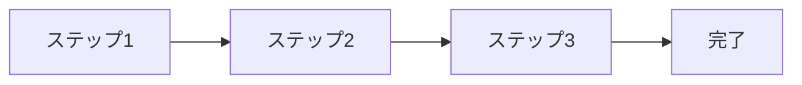
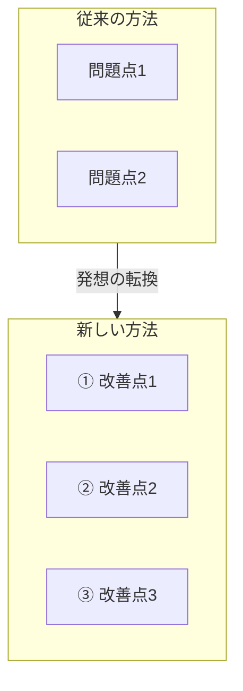
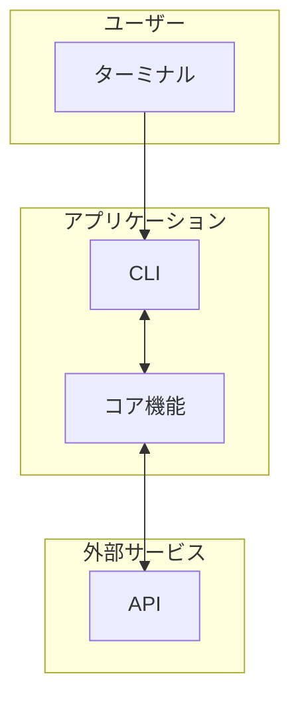
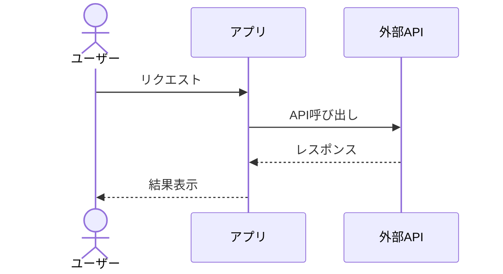
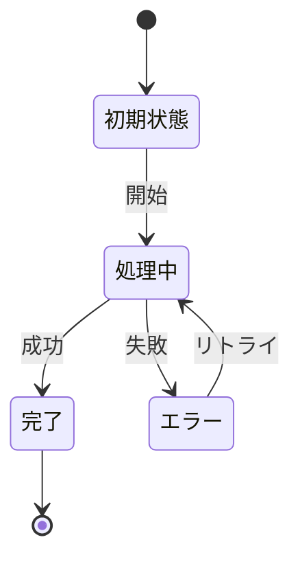

# Mermaid Diagram スキル

Zenn記事向けのMermaid図表を作成する。

## 対応図表

| 図の種類 | 用途 | 非エンジニア向け |
|---------|------|----------------|
| シンプルフロー | 手順、プロセス | ◎ 推奨 |
| 比較図（Before/After） | 従来 vs 新方式 | ◎ 推奨 |
| アーキテクチャ図 | システム構成 | △ 簡略化必要 |
| シーケンス図 | 処理の流れ | △ 登場人物3人以内 |
| 状態遷移図 | 状態変化 | △ 状態5つ以内 |
| レイヤー構造図 | 階層関係 | × 避ける |
| ER図 | データ構造 | × 避ける |

## ディレクトリ構造

Mermaidではなくテキストツリーを使用する：

```
project/
├── src/
│   ├── index.js
│   └── utils/
└── package.json
```

## テンプレート

### 1. シンプルフロー（推奨）



### 2. 比較図（Before/After）



### 2. アーキテクチャ図



### 3. シーケンス図



### 4. 状態遷移図



## 作成ルール

1. **ノード名は日本語で**: `A["日本語ラベル"]` 形式を使用
2. **矢印は意味を持たせる**: `-->` 単方向、`<-->` 双方向
3. **subgraphでグループ化**: 関連要素をまとめる
4. **色は使わない**: Zennのテーマに依存するため

## 非エンジニア向けガイドライン

- ノード数は最大10個まで
- 階層は3段まで
- 専門用語は避ける
- 「〜する」「〜される」で動詞を明確に
