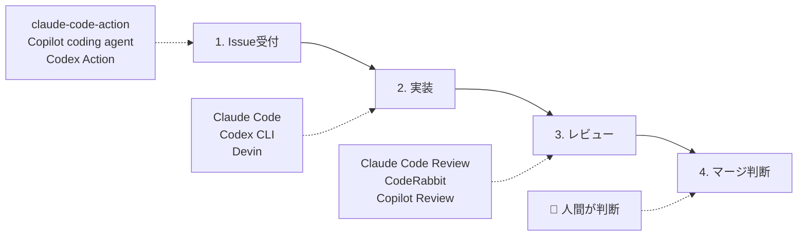

## はじめに

「git initからマージまで、全部AIに任せている」——そんなエンジニアは本当にいるのか。

答えは **「いる。しかも、1日19PRを無人で生成している人がいる」** だ。

一方で、最先端のAIコーディングエージェント Devin ですら **PRのマージ率は67%** にとどまる。3本に1本はやり直しが必要ということだ。

この記事では、世界47の技術メディア・コミュニティを横断調査し、「AIエージェントによるgitワークフロー全自動化」の現在地を報告する。どこまでできて、どこからが危険なのか。

:::message
**この記事でわかること**

- 完全無人開発の最前線事例（日本・海外）
- チーム導入のリアルな成果
- ツールの全体像と選び方
- 調査で見えた7つのリスクと対策
  :::

:::message
**調査対象**: Zenn、Qiita、Medium、dev.to、Hacker News、GitHub Blog、知乎、CSDN、Velog 等 47プラットフォーム（[調査リスト全体](https://zenn.dev/sora_biz)は筆者のプロフィールを参照）
:::

---

## three-levels-of-automation

### 自動化の3段階——あなたはどこにいるか

AIによるgitワークフロー自動化は、大きく3つのレベルに分かれる。

|      レベル       | 何が自動か                                       | 人間がやること         | 該当する人         |
| :---------------: | ------------------------------------------------ | ---------------------- | ------------------ |
| **Lv.3 完全自律** | Issue消化→実装→テスト→commit→PR作成→worktree整理 | 最終マージ承認のみ     | 少数の先駆者       |
|  **Lv.2 半自律**  | Issue→自動実装→PR作成                            | レビュー・承認・マージ | チーム導入の先端層 |
|   **Lv.1 補助**   | commitメッセージ生成、PR説明文、レビュー支援     | 開発作業の大部分       | 大多数             |

多くのエンジニアはLv.1にいる。この記事では、Lv.2〜Lv.3の世界で何が起きているかを見ていく。

---

## full-automation-cases

### 完全無人化の最前線——世界の4事例

#### 1. umihico氏（日本）——1日13-19 PR を無人生成

日本の個人開発者 umihico氏は、Boss/Workerアーキテクチャで24時間無人稼働する開発システムを構築した。

- **仕組み**: Boss（親プロセス）が5分ごとにGitHub Issueを監視し、Workerを生成。各Workerがgit worktreeで独立ブランチを作り、TDD形式で実装してPRを作成、Issueをクローズする
- **ツール**: Claude Code Max + tmux + devcontainer
- **実績**: 2025年7月の稼働開始以降、1日平均10〜20 Issue消化・13〜19 PR生成
- **セキュリティ**: devcontainerでネットワーク接続先をホワイトリスト制御

出典: [Zenn — Claude Code Maxで実現する完全自動並列開発システム](https://zenn.dev/studio_prairie/articles/90f5fc48a6dea7)

#### 2. Devin（米国・Cognition AI）——PRマージ率67%

商用で最も自律的なAIコーディングエージェント。Goldman Sachs、Nubank等の大企業で導入されている。

- **仕組み**: クラウド上で完全自律動作。Issueを渡すと、調査→計画→実装→テスト→PR作成まで無人で実行
- **実績**: PRマージ率67%（前年の34%から倍増）。数十万PRをマージ済み
- **制約**: 残り33%はリワークが必要。「ジュニア開発者のコードとして扱え」が公式推奨

出典: [Cognition Blog — Devin's 2025 Performance Review](https://cognition.ai/blog/devin-annual-performance-review-2025)

#### 3. Auto-Claude（OSS）——最大12並列セッション

OSSフレームワーク。Kanbanボードで視覚的にタスク管理し、複数エージェントが並列で自律開発する。

- **仕組み**: Discovery→Requirements→Spec→Plan→Implementation→QA Validation の6フェーズを自動通過。全作業がisolated worktreeで実行される
- **実績**: 1つのプロンプトから11のサブエージェントタスクを自動生成した事例あり
- **安全策**: QA Validationループで品質を担保。メインブランチは安全

出典: [GitHub — AndyMik90/Auto-Claude](https://github.com/AndyMik90/Auto-Claude) / [Geeky Gadgets](https://www.geeky-gadgets.com/autoclaude-setup-guide-for-faster-builds/)

#### 4. Ralph（OSS）——24時間稼働＋暴走防止

Geoffrey Huntley氏の手法をベースにした自律開発ループ。「暴走しない」ことに重点を置いた設計が特徴。

- **仕組み**: Claude Codeを繰り返し実行し、完了を検知したら停止する自律ループ
- **安全策**: 3層の終了検知——(1)ループ回数上限、(2)テスト比率が30%を超えたら停止、(3)完了シグナルとEXIT_SIGNALの両方が揃わないと終了しない
- **稼働**: 24時間連続稼働対応。API制限の自動検知と待機機能も内蔵

出典: [GitHub — frankbria/ralph-claude-code](https://github.com/frankbria/ralph-claude-code)

#### 比較表

| 比較軸     | umihico                 | Devin        | Auto-Claude  | Ralph        |
| ---------- | ----------------------- | ------------ | ------------ | ------------ |
| 稼働形態   | セルフホスト            | クラウドSaaS | セルフホスト | セルフホスト |
| 並列数     | Boss+複数Worker         | 複数同時     | 最大12       | 単一ループ   |
| PRマージ率 | 非公開                  | 67%          | 非公開       | 非公開       |
| コスト     | Claude Code Max（定額） | $500/月〜    | API従量課金  | API従量課金  |
| 暴走防止   | devcontainer            | 内蔵         | QAループ     | 3層検知      |

---

## team-adoption-cases

### チーム導入のリアル

個人開発と異なり、チームでは「レビュー・承認・マージは人間」が前提になる。それでも劇的な効率化が報告されている。

#### incident.io——「2時間の見積もりが10分で終わった」

英国のインシデント管理SaaS企業。4〜5個のClaude Codeエージェントを同時に走らせ、各worktreeで独立した機能開発を行っている。

> 「Claude Code導入前はゼロだったのが、今は常時4〜5個のエージェントが同時に動いている」

出典: [incident.io Blog](https://incident.io/blog/shipping-faster-with-claude-code-and-git-worktrees) / [Spotify Podcast](https://open.spotify.com/episode/4qbxHN9ZAsoCsPOMojYPfk)

#### Chamith Madusanka——エンタープライズでの@claude統合

Go + React + TypeScript + Terraform のエンタープライズ環境で、GitHub Issueに `@claude` とメンションするだけで自動的にブランチ作成→修正→テスト→PR作成まで完了する仕組みを構築した。

出典: [Medium](https://chamith.medium.com/how-we-integrated-claude-code-into-our-github-workflow-97a5db8bcb8e)

#### ショウタ氏——実装時間75%削減

Claude Codeが設計・レビューを担当し、Codexが `--approval-mode auto` で自律実装する役割分担を確立。

- **実績**: 実装時間75%削減（8時間→2時間/機能）、週あたりPR数が3-4件→8-10件に増加

出典: [Zenn](https://zenn.dev/shotani/articles/2026-03-03-claude-code-codex-indie-dev-automation)

---

## tools-map

### ツール相関図——何を組み合わせるか

gitワークフローの自動化は、4つのフェーズに分かれる。それぞれに適したツールが存在する。

#### 公式ツール

| ツール                                                                                                     | 提供元    | 得意なフェーズ                |
| ---------------------------------------------------------------------------------------------------------- | --------- | ----------------------------- |
| [claude-code-action](https://github.com/anthropics/claude-code-action)                                     | Anthropic | Issue受付→実装→PR作成         |
| [codex-action](https://github.com/openai/codex-action)                                                     | OpenAI    | CI/CDでの自動レビュー・パッチ |
| [Copilot coding agent](https://docs.github.com/en/copilot/concepts/agents/coding-agent/about-coding-agent) | GitHub    | Issue→自律実装→PR作成         |
| [GitHub Agentic Workflows](https://github.github.com/gh-aw/)                                               | GitHub    | 自然言語→Actions YAML生成     |

#### コミュニティツール

| ツール                                                                         | 作者        | 特徴                                                       |
| ------------------------------------------------------------------------------ | ----------- | ---------------------------------------------------------- |
| [Issue Workflow](https://zenn.dev/driller/articles/claude-code-issue-workflow) | driller     | Issue→TDD→品質ゲート→PR→マージの全自動化                   |
| [Ruflo](https://github.com/ruvnet/ruflo)                                       | ruvnet      | 54+エージェントのスウォーム。GitHub PR管理含む200+ツール   |
| [ccmanager](https://github.com/kbwo/ccmanager)                                 | kbwo        | Claude/Gemini/Codex/Cursorのセッションをworktreeごとに管理 |
| [Auto-Claude](https://github.com/AndyMik90/Auto-Claude)                        | AndyMik90   | Kanban+12並列+QAループ                                     |
| [Ralph](https://github.com/frankbria/ralph-claude-code)                        | frankbria   | 自律ループ+3層の暴走防止                                   |
| [AionUi](https://github.com/iOfficeAI/AionUi)                                  | iOfficeAI   | スケジュール実行+WebUI。無料OSS                            |
| [Oh My ClaudeCode](https://github.com/Yeachan-Heo/oh-my-claudecode)            | Yeachan Heo | 32専門エージェント+40+スキル。5並列ワーカー                |

---

## platform-info-density

### どこに情報があるか——プラットフォーム別ランキング

47プラットフォームを調査した結果、情報量には大きな偏りがあった。

| 順位 | プラットフォーム | 情報量 | 特徴                                                                   |
| :--: | ---------------- | ------ | ---------------------------------------------------------------------- |
|  1   | **Zenn**         | 168件+ | 日本語圏で圧倒的。具体的なコード・設定・実測値を含む高品質な事例が最多 |
|  2   | **Medium**       | 多数   | 英語圏で最も事例が豊富。チーム導入記事も多い                           |
|  3   | **GitHub Blog**  | 重要   | Agentic Workflows、Copilot coding agent等の一次情報源                  |
|  4   | **Qiita**        | 多数   | 日本語圏で2番目。具体的な実装事例あり                                  |
|  5   | **dev.to**       | 多数   | 英語圏コミュニティ。ハンズオンガイドが多い                             |
|  6   | **知乎 / CSDN**  | あり   | 中国語圏。翻訳・解説記事が中心だが独自事例も                           |
|  7   | **Velog**        | あり   | 韓国語圏。カスタム命令・オーケストレーション記事あり                   |

**該当記事が見つからなかったプラットフォーム**（18件）:
Netflix / Stripe / Spotify / Atlassian テックブログ、Google / AWS / Microsoft テックブログ、The Register、Heise Online、freeCodeCamp、DZone、DataCamp、GeeksforGeeks、CSS-Tricks、A List Apart、Smashing Magazine、Tistory、Naver Blog（一般紹介のみ）

注目すべきは **Zennの168件+** という数字だ。この分野の情報発信において、日本語圏のエンジニアコミュニティが世界的に見ても活発であることを示している。

---

## seven-risks

### 光だけではない——調査で見えた7つのリスク

完全無人化は技術的に可能だ。しかし、調査を進めるほど「光」だけでなく「影」も鮮明になった。

#### 1. 技術的負債が48%増加する

AI生成コードによるコピペコードが48%増加し、2週間以内のコード取り消し率（code churn）が2倍になったという調査結果がある。75%の企業でAI起因の技術的負債が「中〜高」レベルに上昇している。

> 「2年目以降、管理されていないAI生成コードはメンテナンスコストを4倍に押し上げる」

出典: [SecurityWeek](https://www.securityweek.com/how-to-eliminate-the-technical-debt-of-insecure-ai-assisted-software-development/) / [InfoQ](https://www.infoq.com/news/2025/11/ai-code-technical-debt/)

#### 2. セキュリティリスク——87%汚染の連鎖

自律エージェントには、プロンプトインジェクション、権限エスカレーション、サプライチェーン攻撃などのリスクがある。研究によると、**1つの侵害されたエージェントが4時間以内に下流の意思決定の87%を汚染する**。

出典: [Stellar Cyber](https://stellarcyber.ai/learn/agentic-ai-securiry-threats/)

#### 3. カスケード障害——エラーが複利で蓄積する

長時間の無人稼働中、ハルシネーション（AIの事実誤認）やコンテキストエラーが**複利的に蓄積**する。稼働時間が長いほどリスクは増大する。Claude Codeの連続稼働時間は3ヶ月で25分未満から45分超に倍増しており、それだけ蓄積リスクも増えている。

出典: [Stack Overflow Blog](https://stackoverflow.blog/2026/01/28/are-bugs-and-incidents-inevitable-with-ai-coding-agents/)

#### 4. コスト爆発——2つのPRで$100超

Claude Code ReviewでPRレビューを実行したところ、**2つのPRだけで$100超**かかったという報告がある。API従量課金の場合、無人でPRを量産すればコストも比例して膨れ上がる。

出典: [Zenn — canly](https://zenn.dev/canly/articles/1535fde47ca866)

#### 5. 最先端でもマージ率67%

前述の通り、Devinですら**3本に1本のPRはリワークが必要**。完全無人化で「量」は出せても、「質」の保証にはまだ人間の関与が不可欠だ。

#### 6. コードの可読性が低下する

AI生成コードは「大量のハーネスコード＋少ないインラインコメント」になりがちで、ロジックエラーが紛れ込みやすい。大きなコミットと読みにくいコードの組み合わせは、レビューの負担を増大させる。

出典: [Codebridge](https://www.codebridge.tech/articles/the-hidden-costs-of-ai-generated-software-why-it-works-isnt-enough)

#### 7. エンジニアのスキルが低下する

Anthropicの研究（2026年1月）によると、AIを使ったグループのコーディングスコアは手コーディング比で**-17%**。特にデバッグ能力の低下が顕著だった。

出典: [Anthropic Research](https://arxiv.org/abs/2601.20245)

---

## countermeasures

### リスクへの処方箋——先人たちの7つの対策

リスクは「やめる理由」ではなく「備える理由」だ。先駆者たちは、それぞれの方法でリスクに対処している。

| リスク                     | 対策                                                                                             | 参考実装                                                                                                                                                                                                                 |
| -------------------------- | ------------------------------------------------------------------------------------------------ | ------------------------------------------------------------------------------------------------------------------------------------------------------------------------------------------------------------------------ |
| **暴走（カスケード障害）** | ループ回数上限・テスト比率監視・完了シグナル検知で自動停止                                       | Ralph: `MAX_CONSECUTIVE_TEST_LOOPS=3`, `TEST_PERCENTAGE_THRESHOLD=30%`                                                                                                                                                   |
| **セキュリティ**           | devcontainerでネットワークホワイトリスト制御。読み取り専用パーミッションをデフォルトに           | [Trail of Bits devcontainer](https://github.com/trailofbits/claude-code-devcontainer)、[Docker Sandboxes](https://www.docker.com/blog/docker-sandboxes-run-claude-code-and-other-coding-agents-unsupervised-but-safely/) |
| **品質（マージ率）**       | 実装AIとレビューAIを分離する二重チェック。人間は最終承認に集中                                   | Claude Code実装 → [CodeRabbit](https://zenn.dev/ktsushima/articles/coderabbit-claude-code-integration)レビュー → 修正 → マージ                                                                                           |
| **技術的負債**             | code churn率を定期計測。AIの出力を「ジュニア開発者のコード」として扱い、可読性をスポットチェック | [Anthropic: Measuring Agent Autonomy](https://www.anthropic.com/research/measuring-agent-autonomy)                                                                                                                       |
| **コスト爆発**             | 定額プラン（Claude Code Max）を使用。`--max-turns`でフェーズごとの呼び出し上限設定               | AZM氏: Plan=10ターン、Do=50ターンの制限設計                                                                                                                                                                              |
| **コード可読性**           | AI実装後にリファクタリング専用のレビューパスを追加。大きなPRは分割を強制                         | ShintaroAmaike氏の[6種専門エージェントレビュー](https://zenn.dev/shintaroamaike/articles/86187d64045449)                                                                                                                 |
| **スキル低下**             | AI出力を必ず読み、「なぜこの実装か」を理解してからマージする習慣をつける                         | Devin公式: 「ジュニア開発者のコードとして扱え」                                                                                                                                                                          |

---

## roadmap

### 明日から始めるロードマップ

「全部一気にやる」必要はない。自分の状況に合ったステップから始めればいい。

| あなたの状況                     | 次のステップ                                | 参考記事                                                                                                          |
| -------------------------------- | ------------------------------------------- | ----------------------------------------------------------------------------------------------------------------- |
| commitメッセージを手で書いている | Claude Codeに `git commit` を任せる         | [Claude Code 便利機能まとめ](claude-code-tips-and-features)                                                       |
| PRレビューを手動でやっている     | GitHub Actions + `@claude` でレビュー自動化 | [Claude CodeをGitHubに住まわせる](claude-code-github-actions-guide)                                               |
| 1ブランチで順番に開発している    | git worktreeで並列開発を開始                | [2つ同時に動かす並列開発](claude-code-parallel-worktrees)                                                         |
| レビューの質を上げたい           | 実装AIとレビューAIを分離する                | [AIにコードを書かせてAIにレビューさせる](claude-code-ai-review-workflow)                                          |
| Issue→PRまで自動化したい         | claude-code-action を導入                   | [Anthropic公式](https://github.com/anthropics/claude-code-action)                                                 |
| 完全無人化を目指したい           | Ralph or Auto-Claude + devcontainer         | [Ralph](https://github.com/frankbria/ralph-claude-code) / [Auto-Claude](https://github.com/AndyMik90/Auto-Claude) |

---

## conclusion

### まとめ

47プラットフォームを調査してわかったことを3つにまとめる。

**1. 完全無人化は技術的に可能だ。**
umihico氏の1日13-19 PR、Auto-Claudeの12並列セッション、Ralphの24時間自律稼働。個人開発なら、Issue消化からPR作成まで人間がほぼ触らない開発は現実のものになっている。

**2. しかし、「人間の判断を残す」設計が主流だ。**
GitHub Copilot coding agentは仕様レベルで自動マージを禁止している。Devinでもマージ率は67%。最も進んだ事例でも、マージの最終判断は人間に委ねている。これは「まだできない」のではなく、「あえて残している」設計だ。

**3. 最大の差別化は「リスク管理」にある。**
AIエージェントを導入するだけなら誰でもできる。差がつくのは、暴走防止、セキュリティ、コスト管理、スキル維持といった「守り」の設計だ。技術的負債48%増、セキュリティ汚染87%、スキル低下-17%——これらの数字を知った上で使うのと、知らずに使うのとでは、結果がまったく違う。

---

## references

### 参考リンク集

#### 完全無人化の事例

- [umihico氏 — Claude Code Maxで実現する完全自動並列開発システム](https://zenn.dev/studio_prairie/articles/90f5fc48a6dea7)
- [Devin — 2025 Performance Review](https://cognition.ai/blog/devin-annual-performance-review-2025)
- [Auto-Claude — GitHub](https://github.com/AndyMik90/Auto-Claude)
- [Ralph — GitHub](https://github.com/frankbria/ralph-claude-code)

#### チーム導入事例

- [incident.io — Shipping faster with Claude Code and Git Worktrees](https://incident.io/blog/shipping-faster-with-claude-code-and-git-worktrees)
- [Chamith Madusanka — How We Integrated Claude Code Into Our GitHub Workflow](https://chamith.medium.com/how-we-integrated-claude-code-into-our-github-workflow-97a5db8bcb8e)
- [ショウタ氏 — Claude Code × Codexで個人開発を完全自動化した話](https://zenn.dev/shotani/articles/2026-03-03-claude-code-codex-indie-dev-automation)

#### リスクと対策

- [SecurityWeek — Technical Debt of AI-Assisted Development](https://www.securityweek.com/how-to-eliminate-the-technical-debt-of-insecure-ai-assisted-software-development/)
- [Stack Overflow Blog — Are bugs inevitable with AI coding agents?](https://stackoverflow.blog/2026/01/28/are-bugs-and-incidents-inevitable-with-ai-coding-agents/)
- [Anthropic — AI支援とスキル形成](https://arxiv.org/abs/2601.20245)
- [Anthropic — Measuring Agent Autonomy](https://www.anthropic.com/research/measuring-agent-autonomy)
- [Stellar Cyber — Agentic AI Security Threats](https://stellarcyber.ai/learn/agentic-ai-securiry-threats/)

#### 公式ドキュメント

- [Claude Code — Common Workflows](https://code.claude.com/docs/en/common-workflows)
- [Claude Code — GitHub Actions](https://code.claude.com/docs/en/github-actions)
- [Claude Code — Development Containers](https://code.claude.com/docs/en/devcontainer)
- [OpenAI Codex — Workflows](https://developers.openai.com/codex/workflows/)
- [GitHub Copilot — Coding Agent](https://docs.github.com/en/copilot/concepts/agents/coding-agent/about-coding-agent)
- [GitHub Agentic Workflows](https://github.github.com/gh-aw/)

---

:::message
**関連記事**

- [Claude Codeが急にポンコツになる原因はコンテキストだった](claude-code-context-management)
- [Claude Codeを2つ同時に動かしたら、ブランチ切り替え地獄から解放された](claude-code-parallel-worktrees)
- [Claude CodeをGitHubに住まわせたら、PRレビューが自動化された](claude-code-github-actions-guide)
- [Claude Code でAIにコードを書かせてAIにレビューさせる](claude-code-ai-review-workflow)
- [「昨日の続き」を一瞬で再開する](claude-code-session-management)
  :::
