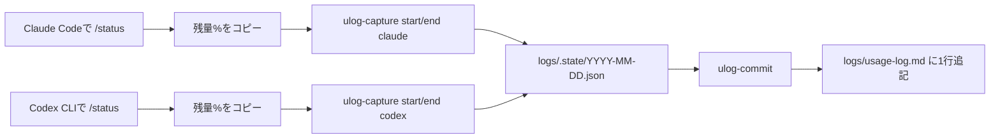

<a id="position"></a>
## この記事の位置づけ

この記事は、以下の関連記事にある「毎日1分記録」を実運用できる形にした詳細版。

- [Claude Codeだけに依存しない: VS Code版Codex併用でコストと品質を両立した話](claude-code-codex-plus-cost-optimization)

対象読者は `Windows + PowerShell` 環境を前提にしています。

---

<a id="toc"></a>
## 目次

1. [この記事で得られること](#what-you-get)
2. [結論](#conclusion)
3. [この記事で採用する運用方式](#approach)
4. [最初のセットアップ（初回1回）](#setup)
5. [役割分担（Claude Code側 / Codex CLI側）](#roles)
6. [毎日の運用手順（準自動フロー）](#daily-flow)
7. [日次ログのテンプレ](#template)
8. [検証が終わったら](#after-validation)
9. [公式で確認すべきポイント](#official-points)
10. [最後に](#closing)

---

<a id="what-you-get"></a>
## この記事で得られること

- `Claude Max 20x` から `Claude Max 5x` への移行判断に必要な最小ログ項目
- Claude CodeとCodex CLIをまたいだ、準自動の日次ログ運用手順
- 初回セットアップと毎日運用の切り分け

---

:::message
**「毎日1分」は定着後の目安**

初回セットアップは5〜15分。最初の数日は2〜3分かかっても正常。  
運用が固まると、60〜90秒で回せるようになる。
:::

---

<a id="conclusion"></a>
## 結論

この運用は「準自動」。

- 初回に1回だけ、ログ置き場とコマンドを作る
- 毎日は `/status` を確認して短いコマンドを実行するだけ
- 検証期間が終わったら、更新を止めてOK

↑ [目次に戻る](#toc)

---

<a id="approach"></a>
## この記事で採用する運用方式

対象は、次の運用。

- Claude Code と Codex CLI は別プロジェクトでもOK
- 使用量ログは「集約ログリポジトリ」1か所にまとめる
- 追記先は `logs/usage-log.md` に統一する

↑ [目次に戻る](#toc)

---

<a id="setup"></a>
## 最初のセットアップ（初回1回）

### 1. 集約ログリポジトリと初期ログを作る

どのプロジェクトからでも参照しやすい固定パスに置く。  
最初は、作業場所に移動してログ用のフォルダを作るところまで進める。

もし別の場所にフォルダを作る場合は、ここで作成するパスと、後続の関数内の `$root` を同じ値にそろえる。

Windows（PowerShell）:

```powershell
cd ~/Documents
mkdir Ops -Force
cd Ops
mkdir ai-ops-log -Force
cd ai-ops-log
mkdir logs -Force
```

※ 本記事はWindows前提のため、macOS/Linux手順は省略します。

ここまでで `ai-ops-log/logs` フォルダの作成は完了。  
次の手順で、`logs/usage-log.md`（初期ヘッダ付き）を作成する。

### 2. 初期ヘッダ付きログファイル（`logs/usage-log.md`）を作成

PowerShell（Windows）:

```powershell
$root = Join-Path $HOME "Documents/Ops/ai-ops-log"
New-Item -ItemType Directory -Force -Path (Join-Path $root "logs") | Out-Null
if (-not (Test-Path (Join-Path $root "logs/usage-log.md"))) {
@"
| date | claude_start | claude_end | codex_start | codex_end | claude_5h_burn | codex_5h_burn | stop_count | stop_min | rework_count | memo |
|---|---:|---:|---:|---:|---:|---:|---:|---:|---:|---|
"@ | Set-Content -Encoding UTF8 (Join-Path $root "logs/usage-log.md")
}
Write-Host "created: $root"
```

※ 本記事はWindows前提のため、Bash手順は省略します。

### 3. 準自動コマンドを定義する

ここが `PowerShell実装` の正体。  
**初回に1回だけ** 実行して、`ulog-capture` と `ulog-commit` を使えるようにする。

```powershell
function ulog-capture {
  param(
    [ValidateSet("start","end")] [string]$phase,
    [ValidateSet("claude","codex")] [string]$tool
  )
  $text = Get-Clipboard
  if ($text -match "(\d+)\%\s*left") { $pct = [int]$Matches[1] } else { throw "残量%が見つかりません" }

  $root = Join-Path $HOME "Documents/Ops/ai-ops-log"
  $stateDir = Join-Path $root "logs/.state"
  New-Item -ItemType Directory -Force -Path $stateDir | Out-Null
  $date = Get-Date -Format "yyyy-MM-dd"
  $file = Join-Path $stateDir "$date.json"
  $obj = if (Test-Path $file) { Get-Content $file -Raw | ConvertFrom-Json } else { [pscustomobject]@{} }
  $obj | Add-Member -NotePropertyName "${tool}_${phase}" -NotePropertyValue $pct -Force
  $obj | ConvertTo-Json | Set-Content -Encoding UTF8 $file
  Write-Host "$tool $phase = $pct%"
}
```

```powershell
function ulog-commit {
  param(
    [int]$stop_count = 0,
    [int]$stop_min = 0,
    [int]$rework_count = 0,
    [string]$memo = ""
  )
  $root = Join-Path $HOME "Documents/Ops/ai-ops-log"
  $date = Get-Date -Format "yyyy-MM-dd"
  $state = Get-Content (Join-Path $root "logs/.state/$date.json") -Raw | ConvertFrom-Json

  $claudeBurn = $state.claude_start - $state.claude_end
  $codexBurn  = $state.codex_start  - $state.codex_end

  $row = "| $date | $($state.claude_start) | $($state.claude_end) | $($state.codex_start) | $($state.codex_end) | $claudeBurn | $codexBurn | $stop_count | $stop_min | $rework_count | $memo |"
  Add-Content -Encoding UTF8 (Join-Path $root "logs/usage-log.md") $row
  Write-Host "logged: $row"
}
```

補足:
- `cd` は不要。関数の中で、ログ保存先を `Documents/Ops/ai-ops-log` として直接指定しているため。
- もし別の場所にフォルダを作った場合は、両方の関数にある次の行だけ書き換える。

```powershell
$root = Join-Path $HOME "Documents/Ops/ai-ops-log"
```

例: `D:\work\ai-ops-log` に置く場合

```powershell
$root = "D:\\work\\ai-ops-log"
```

↑ [目次に戻る](#toc)

---

<a id="roles"></a>
## 役割分担（Claude Code側 / Codex CLI側）

| 担当 | やること | 実行コマンド |
|---|---|---|
| Claude Code側 | `/status` を表示して残量をコピー | `ulog-capture start claude` / `ulog-capture end claude` |
| Codex CLI側 | `/status` を表示して残量をコピー | `ulog-capture start codex` / `ulog-capture end codex` |
| 集約ログ側 | 1日の値を確定して1行追記 | `ulog-commit -stop_count ... -stop_min ... -rework_count ... -memo ...` |



↑ [目次に戻る](#toc)

---

<a id="daily-flow"></a>
## 毎日の運用手順（準自動フロー）

### 実行手順（開始時）

1. `claude` を起動し、`/status` を実行
2. 残量%が表示されている行をコピー
3. PowerShellで `ulog-capture start claude` を実行
4. `codex` を起動し、`/status` を実行
5. 残量%が表示されている行をコピー
6. PowerShellで `ulog-capture start codex` を実行

### 実行手順（終了時）

1. `claude` で再度 `/status` を実行してコピー
2. PowerShellで `ulog-capture end claude` を実行
3. `codex` で再度 `/status` を実行してコピー
4. PowerShellで `ulog-capture end codex` を実行

### 実行手順（1行確定）

`ulog-capture` は一時保存まで。  
日次ログとして残すには、最後に `ulog-commit` を実行して1行確定する。

```powershell
ulog-commit -stop_count 0 -stop_min 0 -rework_count 1 -memo "価格比較セクションを更新"
```

`logs/usage-log.md` に1行追加されたら完了。

### つまずきやすい点

- ペーストは不要。`ulog-capture` はクリップボードを読む
- `codex /status` をシェル直実行すると `stdin is not a terminal` になりやすい  
  `codex` を起動して対話内で `/status` を実行する
- 同時に2つのツールから同じファイルを編集しない

↑ [目次に戻る](#toc)

---

<a id="template"></a>
## 日次ログのテンプレ

このテンプレのヘッダ行は、初回セットアップのスクリプトで自動作成される。  
手動で作っても問題ないが、通常はそのまま自動生成に任せればよい。

```md
| date | claude_start | claude_end | codex_start | codex_end | claude_5h_burn | codex_5h_burn | stop_count | stop_min | rework_count | memo |
|---|---:|---:|---:|---:|---:|---:|---:|---:|---:|---|
| 2026-02-09 | 95 | 72 | 96 | 81 | 23 | 15 | 0 | 0 | 1 | 価格比較セクションを更新 |
```

このログの狙いは、ClaudeとCodexの使用量を同じ単位で並べること。  
`claude_5h_burn` と `codex_5h_burn` はどちらも「5時間枠で何%減ったか」を表すため、移行判断を直感的にしやすい。

ただし、この値は運用判断のための実務目安。  
モデル、会話長、タスク複雑さで変動するため、最終判断は「参考値」として扱うのが安全。

↑ [目次に戻る](#toc)

---

<a id="after-validation"></a>
## 検証が終わったら

このログ運用は、`Claude Max 20x` から `Claude Max 5x` への移行検証期間だけ回せば十分。  
検証が終わったら、`/status` 取得と `ulog-capture` / `ulog-commit` の日次実行を止めればよい。  
特別な停止コマンドは不要で、追記フローを回さなければ `logs/usage-log.md` の更新は自然に止まる。

↑ [目次に戻る](#toc)

---

<a id="official-points"></a>
## 公式で確認すべきポイント

- Codexの上限と usage dashboard: https://developers.openai.com/codex/pricing
- CodexとChatGPTプラン差: https://help.openai.com/en/articles/11369540-using-codex-with-your-chatgpt-plan
- Claude Codeの利用上限の考え方: https://support.claude.com/en/articles/11145838-using-claude-code-with-your-pro-or-max-plan
- Claude Codeカスタムコマンド: https://docs.anthropic.com/en/docs/agents-and-tools/claude-code/slash-commands

↑ [目次に戻る](#toc)

---

<a id="closing"></a>
## 最後に

移行判断は「感覚」ではなく「ログ」。  
まずは2週間、この準自動フローで回して判断するのが最短。

関連記事:
- コスト検証: [Claude Max 20x→5xを狙う月$100削減の検証](claude-code-codex-plus-cost-optimization)
- 設定共有: [指示資産の散乱を防ぐ設定共有ガイド](ai-tooling-skills-rules-sharing-guide)
