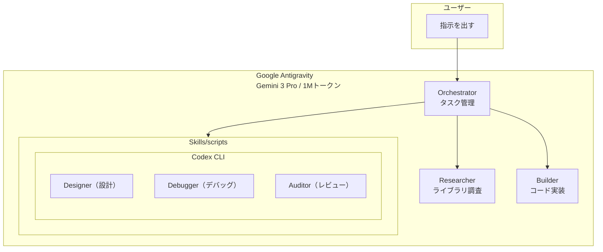
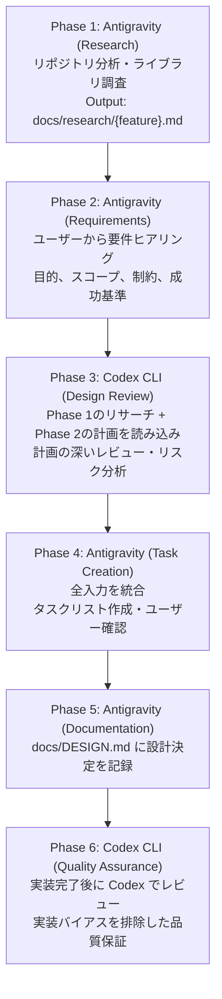
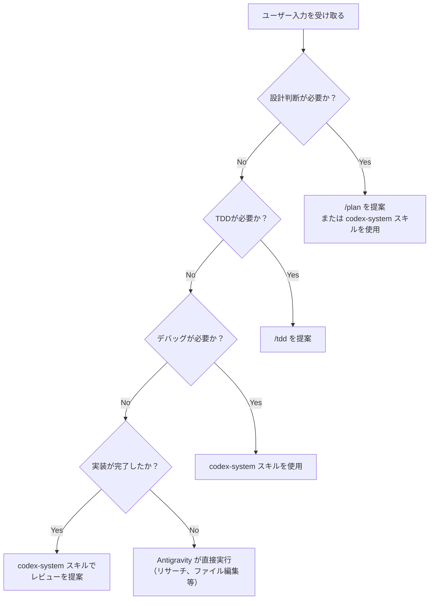

## はじめに

:::message
**シリーズ構成**
- [Google Antigravity インストールガイド（Windows）](antigravity-windows-install-guide)
- [Google Antigravity × Codex CLI でデュアルエージェント開発](antigravity-codex-dual-agent-guide)
- **Google Antigravity × Codex CLI 協調開発：Orchestra方式でタスク自動振り分け**（この記事）
- [Antigravityを安全に使うために知っておくべきこと](antigravity-security-guide)
:::

この記事は、**Claude Code Orchestra** の考え方を **[Google Antigravity](https://antigravity.google)** で再現する試みです。

Claude Code Orchestra は、Claude Code をオーケストレーター（指揮者）として、複数の AI エージェントを協調させるマルチエージェント開発手法です。

:::message
**参考にした資料**
- [Claude Code Orchestra: Claude Code × Codex CLI × Gemini CLIの最適解を探る](https://zenn.dev/mkj/articles/claude-code-orchestra_20260120) by @mkj（松尾研究所）
- [GitHub: DeL-TaiseiOzaki/claude-code-orchestra](https://github.com/DeL-TaiseiOzaki/claude-code-orchestra)

素晴らしいアーキテクチャを公開してくださった原著者の方々に感謝します。
:::

### この記事でやること

オリジナルの Claude Code Orchestra を **Antigravity ユーザー向けに移植** します。

| オリジナル | この記事 |
|-----------|---------|
| Claude Code がオーケストレーター | **Google Antigravity** がオーケストレーター |
| Gemini CLI でリサーチ | Antigravity 自身がリサーチ（Gemini 3 Pro） |
| Hooks で自動協調提案 | **Rules で判断ルールを定義** |
| 13 Skills + 6 Hooks | **6 Workflows + 5 Skills + 8 Rules** |

:::message alert
**Antigravity はパブリックプレビュー版です**

正直に言います。

Claude Code と比べて **無料枠が圧倒的に大きい** のは最大のメリット。1Mトークンのコンテキストも魅力的です。

でも、頻繁なアップデートやバグ報告もあり、「昨日まで動いてたのに…」ということも起きます。これが現実。

だからこそ、最新情報のキャッチアップが大切です。この記事も随時更新していくので、**GitHub や X のフォロー** をお願いします。
:::

---

## この記事の読み方

:::message
**すぐ試したい方** → [セットアップ](#セットアップ) から始めてください（約10分）

**概念を理解したい方** → [Orchestra方式とは](#orchestra方式とは) → [基本的な使い方](#基本的な使い方) の順で読んでください

**問題が発生した方** → [トラブルシューティング](#トラブルシューティング) を参照してください
:::

### 目次

| セクション | 内容 |
|-----------|------|
| [Orchestra方式とは](#orchestra方式とは) | 別タブ運用の問題点と解決策、役割分担 |
| [セットアップ](#セットアップ) | 前提条件、git clone、パス設定、動作確認 |
| [ディレクトリ構成](#ディレクトリ構成) | テンプレートのフォルダ構造 |
| [基本的な使い方](#基本的な使い方) | /startproject、/plan、/tdd の使い方 |
| [Workflows の詳細](#workflows-の詳細) | 6つのワークフローの詳細説明 |
| [Skills の詳細](#skills-の詳細) | 5つのスキルの詳細説明 |
| [Rules の詳細](#rules-の詳細) | 8つのルールの詳細説明 |
| [トラブルシューティング](#トラブルシューティング) | よくある問題と対策 |
| [まとめ](#まとめ) | 実現したこと、メリット、次のステップ |

---

## Orchestra方式とは

### 「別タブ運用」の問題点

「Antigravity と [Codex CLI](https://github.com/openai/codex) を別々のタブで開いて使えばいいのでは？」と思うかもしれません。

しかし、この運用には大きな問題があります。

| 問題 | 症状 |
|------|------|
| **認知負担が大きい** | 2つのタブを行き来し、それぞれの状態を把握する必要がある |
| **コンテキストが分断** | Antigravity は Codex に何を聞いたか知らない |
| **情報の橋渡しが手動** | 「Codex がこう言ってた」と自分でコピペして伝える必要がある |
| **判断の一貫性がない** | お互いに相談しない部下2人を雇っているような状態 |

### Orchestra方式の解決策

**インターフェースは Antigravity だけ。** ユーザーは Antigravity とだけ対話し、必要に応じて Antigravity が Codex に相談します。



### 役割分担

| 役割 | 担当 | タスク |
|------|------|--------|
| **Orchestrator** | Antigravity | ユーザー対話、タスク管理、ワークフロー制御 |
| **Researcher** | Antigravity | ライブラリ調査、ドキュメント検索（1Mトークン活用） |
| **Builder** | Antigravity | Codex の設計に基づくコード実装、ファイル編集 |
| **Designer** | Codex CLI | アーキテクチャ設計、実装計画、トレードオフ分析 |
| **Debugger** | Codex CLI | 根本原因分析、複雑なバグ調査 |
| **Auditor** | Codex CLI | コードレビュー、品質チェック、TDD設計 |

> 役割分担の詳細なルールは [Rules の詳細 > role-boundaries.md](#role-boundariesmd役割境界) を参照してください。

---

## セットアップ

> ↑ [目次に戻る](#この記事の読み方)

:::message alert
**所要時間**: 約10分（前提条件が揃っている場合）
:::

### 前提条件

以下がインストール済みであることを確認してください。

| 必要なもの | 確認方法 | インストールガイド |
|-----------|----------|-------------------|
| Google Antigravity | Antigravity が起動できる | [インストールガイド](antigravity-windows-install-guide) |
| WSL2 (Ubuntu) | PowerShell で `wsl --version` | [WSL2インストールガイド](wsl2-windows-install-guide) |
| Node.js + Codex CLI | WSL で `codex --version` | [デュアルエージェント開発ガイド](antigravity-codex-dual-agent-guide#step-1-codex-cli-のセットアップ) |
| ChatGPT Plus/Pro | OpenAI サブスクリプション | $20/月〜（OAuth認証） |

---

### Step 1: テンプレートの取得

#### 方法A: git clone（推奨）

WSL2 の Ubuntu ターミナルで実行：

```bash
# プロジェクトを置きたい親フォルダに移動（例: Documents/Projects）
cd /mnt/c/Users/{あなたのユーザー名}/Documents/Projects

# テンプレートをクローン（my-project という名前のフォルダが作成されます）
git clone https://github.com/Sora-bluesky/antigravity-orchestra.git my-project

# 作成されたフォルダに移動
cd my-project
```

上記を実行すると、以下のようなフォルダ構造になります：

```
Documents/
└── Projects/
    └── my-project/          ← ここにテンプレートがクローンされる
        ├── .agent/
        ├── .codex/
        ├── docs/
        └── ...
```

:::message
**補足**
- `{あなたのユーザー名}` は Windows のユーザー名に置き換えてください
- `my-project` は好きなプロジェクト名に変更できます
:::

#### 方法B: ZIPダウンロード（gitがない場合）

1. [GitHubリポジトリ](https://github.com/Sora-bluesky/antigravity-orchestra) にアクセス
2. 緑の「Code」ボタン → 「Download ZIP」をクリック
3. ダウンロードしたZIPを解凍（`antigravity-orchestra-main` フォルダが作成されます）
4. 解凍したフォルダを `C:\Users\{あなたのユーザー名}\Documents\Projects\` に移動
5. 必要に応じてフォルダ名を `my-project` などに変更

---

### Step 2: パスの設定

Codex CLI を呼び出すスクリプトにパスを設定します。

#### 2-1: パスの確認（WSL2内で実行）

```bash
which node
which codex
```

出力例：
```
/usr/bin/node
/usr/local/bin/codex
```

#### 2-2: スクリプトの編集

Antigravity でプロジェクトを開き、`.agent/skills/codex-system/scripts/ask_codex.ps1` を開きます。

ファイル上部のパス設定を、先ほど確認したパスに書き換えます：

```powershell
# === パス設定（環境に合わせて変更） ===
$NodePath = "/usr/bin/node"           # which node の結果
$CodexPath = "/usr/local/bin/codex"   # which codex の結果
```

同様に `review.ps1` も編集します。

---

### Step 3: Antigravity でプロジェクトを開く

1. **Antigravity を起動**（スタートメニューまたはタスクバーから）
2. **File → Open Folder** をクリック（または `Ctrl+K, Ctrl+O`）
3. 以下のフォルダに移動：
   - `C:\Users\{あなたのユーザー名}\Documents\Projects\my-project`
4. **「フォルダーの選択」** をクリック

---

### Step 4: 動作確認

Antigravity でプロジェクトを開いた状態で、以下を試してください。

```
/startproject Hello World を表示するプログラム
```

Antigravity が以下のように動作すれば成功です：

1. リサーチフェーズが開始される
2. 要件のヒアリングが行われる
3. （設計判断が必要な場合）Codex への相談が提案される

:::message alert
**エラーが出る場合**
[トラブルシューティング](#トラブルシューティング) を参照してください。
:::

---

## ディレクトリ構成

クローンしたテンプレートは以下の構成になっています。

> 各フォルダの詳細: [Workflows の詳細](#workflows-の詳細) | [Skills の詳細](#skills-の詳細) | [Rules の詳細](#rules-の詳細)

```
my-project/
├── .agent/                           # Antigravityワークスペース設定
│   ├── workflows/                    # ワークフロー（6個）
│   │   ├── startproject.md           # /startproject（メインワークフロー）
│   │   ├── plan.md                   # /plan
│   │   ├── tdd.md                    # /tdd
│   │   ├── simplify.md               # /simplify
│   │   ├── checkpoint.md             # /checkpoint
│   │   └── init.md                   # /init
│   │
│   ├── skills/                       # スキル（5個）
│   │   ├── codex-system/             # Codex CLI連携
│   │   │   ├── SKILL.md
│   │   │   └── scripts/
│   │   │       ├── ask_codex.ps1     # 設計・デバッグ用
│   │   │       └── review.ps1        # レビュー用
│   │   ├── design-tracker/           # 設計決定追跡
│   │   ├── research/                 # リサーチ
│   │   ├── update-design/            # DESIGN.md更新
│   │   └── update-lib-docs/          # ライブラリ文書更新
│   │
│   └── rules/                        # ルール（8個）
│       ├── language.md               # 英語思考、日本語応答
│       ├── codex-delegation.md       # Codex委譲ルール
│       ├── delegation-triggers.md    # 自動振り分け（Hooks代替）
│       ├── role-boundaries.md        # 役割境界
│       ├── coding-principles.md      # コーディング規約
│       ├── dev-environment.md        # 開発環境
│       ├── security.md               # セキュリティ
│       └── testing.md                # テスト規約
│
├── .codex/                           # Codex CLI設定
│   └── AGENTS.md
│
├── docs/                             # 知識ベース
│   ├── DESIGN.md                     # 設計決定記録
│   ├── research/                     # リサーチ結果
│   └── libraries/                    # ライブラリ制約
│
└── logs/
    └── codex-responses/              # Codex相談ログ
```

---

## 基本的な使い方

> 各ワークフローの詳細な動作は [Workflows の詳細](#workflows-の詳細) を参照してください。

### /startproject - 新機能の開発

プロジェクトの開発を始めるときに使います。

```
/startproject お問い合わせフォーム
```

Antigravity が自動的に 6 フェーズを実行：

1. **Phase 1**: リポジトリ分析・ライブラリ調査
2. **Phase 2**: 要件のヒアリング
3. **Phase 3**: Codex に設計レビューを委譲
4. **Phase 4**: タスクリストの作成
5. **Phase 5**: 設計決定を docs/DESIGN.md に記録
6. **Phase 6**: 実装完了後に Codex でレビュー

:::message
**最初の一歩**
まずは「Hello World を表示」のような簡単な機能で試してください。フローを体験してから、本格的な機能に挑戦しましょう。
:::

### /plan - 実装計画の作成

特定の機能の実装計画を立てたいときに使います。

```
/plan TODOリストの保存機能
```

### /tdd - テスト駆動開発

テストを先に書いてから実装する Red-Green-Refactor サイクルで開発します。

```
/tdd 電卓の足し算機能
```

### 自然な会話での相談

ワークフローを使わなくても、自然な会話で相談できます。

```
この機能、どう設計すべき？
```

Antigravity が [Rules](#rules-の詳細) に基づいて判断し、必要に応じて Codex に相談します。

```
このエラーの原因がわからない
```

デバッグが必要と判断された場合、Codex に根本原因分析を委譲します。

> 自動判断のルールは [Rules の詳細 > delegation-triggers.md](#delegation-triggersmd最重要) を参照してください。

---

## Workflows の詳細

ワークフローは `/コマンド名` でユーザーが明示的に起動する、複数ステップの手順です。

### /startproject の 6 フェーズ



### その他のワークフロー

| ワークフロー | 用途 |
|-------------|------|
| `/plan` | 要件を具体的なステップに分解 |
| `/tdd` | Red-Green-Refactor サイクルで実装 |
| `/simplify` | コードのリファクタリング |
| `/checkpoint` | セッションの状態を保存 |
| `/init` | 新規プロジェクトに Orchestra 環境をセットアップ |

---

## Skills の詳細

スキルはエージェントが判断して使用する、知識や手順の定義です。

### codex-system - Codex CLI連携

設計判断・デバッグ・レビューを Codex に委譲するための核心スキル。

> このスキルを使うには [Step 2: パスの設定](#step-2-パスの設定) が必要です。

**いつ使うか（キーワード検出）：**

| 分類 | キーワード |
|------|-----------|
| 設計系 | 「設計」「アーキテクチャ」「どう作る」「design」「architecture」 |
| デバッグ系 | 「なぜ動かない」「エラー」「バグ」「debug」「error」 |
| レビュー系 | 「レビュー」「チェック」「確認」「review」「check」 |

**使わないとき：**
- 単純なファイル編集
- リサーチ・調査（Antigravity 自身が行う）
- ユーザーとの会話

### その他のスキル

| スキル | 用途 |
|--------|------|
| design-tracker | 設計決定を docs/DESIGN.md に追跡・記録 |
| research | ライブラリ調査とドキュメント作成 |
| update-design | DESIGN.md の更新 |
| update-lib-docs | ライブラリ制約の文書化 |

---

## Rules の詳細

ルールは常時適用される制約や判断基準です。

### delegation-triggers.md（最重要）

Claude Code Orchestra の 6つの Hooks を Rules で代替します。

**判断フロー：**



### role-boundaries.md（役割境界）

Antigravity と Codex の役割分担を明確にし、役割侵犯を防ぎます。

| Antigravity が行うこと | Codex に委譲すること |
|----------------------|---------------------|
| ユーザー対話 | テスト設計（TDD） |
| ライブラリ調査 | アーキテクチャ設計 |
| ファイル編集 | トレードオフ分析 |
| コード実装 | 根本原因分析 |
|  | コードレビュー |

**Quick Rule: 「これ、設計の判断が必要？」と思ったら → Codex に委譲**

### その他のルール

| ルール | 内容 |
|--------|------|
| language.md | 思考は英語、ユーザーへの応答は日本語 |
| codex-delegation.md | Codex への委譲ルール詳細 |
| coding-principles.md | シンプルさ、単一責任、早期リターン |
| dev-environment.md | 開発環境設定（uv, ruff, pytest等） |
| security.md | 機密情報管理、入力検証 |
| testing.md | TDD、AAA パターン、カバレッジ目標 |

---

## トラブルシューティング

> 基本的な使い方は [基本的な使い方](#基本的な使い方) を参照してください。

### Codex への相談が実行されない

**症状**: Antigravity が codex-system スキルを使わない

**対策**:
1. 明示的に「Codex に相談して」と依頼
2. `delegation-triggers.md` のキーワードを確認
3. `.agent/rules/` にファイルが正しく配置されているか確認

### ask_codex.ps1 でエラーが出る

**症状**: パスが見つからない、タイムアウト

**対策**:
1. WSL で `which node` と `which codex` を再確認
2. `ask_codex.ps1` のパス設定を更新
3. WSL が起動しているか確認（`wsl --status`）

### 役割境界が守られない

**症状**: Antigravity が直接テスト設計を始める

**対策**:
1. 「TDDはCodexに委譲して」と明示的に指示
2. `role-boundaries.md` を確認

### git clone でエラーが出る

**症状**: `git: command not found`

**対策**（WSL2内で実行）:
```bash
sudo apt update
sudo apt install git -y
```

---

## まとめ

> ↑ [目次に戻る](#この記事の読み方)

### この記事で実現したこと

1. **Claude Code Orchestra を Antigravity に移植** - 6 Workflows + 5 Skills + 8 Rules
2. **git clone で簡単セットアップ** - 複雑な手動設定が不要
3. **役割分担の明確化** - Antigravity と Codex の協調
4. **Hooks の Rules 代替** - delegation-triggers.md で自動振り分け

### メリット

| メリット | 説明 |
|----------|------|
| **視点の多様性** | Google と OpenAI、2社の AI の視点でチェック |
| **自動振り分け** | ルールに基づいて適切なエージェントに委譲 |
| **知識の蓄積** | docs/ に設計決定を記録、次回以降も参照可能 |
| **1Mトークン活用** | Antigravity 自身がリサーチを担当 |

### 次のステップ

1. `/startproject Hello World` で基本フローを体験
2. 慣れたら `/tdd` でテスト駆動開発を試す
3. 自分のアイデアで本格的なプロジェクトを開始

:::message
**最新情報をキャッチアップ**

Antigravity はパブリックプレビュー版のため、仕様変更やバグ修正が頻繁に行われます。

この記事も随時更新していきます。最新情報を逃さないために：

- **GitHub**: [リポジトリをWatch/Star](https://github.com/Sora-bluesky/antigravity-orchestra)
- **X (Twitter)**: [@sora_biz](https://x.com/sora_biz) をフォロー

質問やフィードバックも大歓迎です！
:::

---

## 参考リンク

### 本記事の参考資料

| 資料 | 著者 | 内容 |
|------|------|------|
| [Claude Code Orchestra](https://zenn.dev/mkj/articles/claude-code-orchestra_20260120) | @mkj（松尾研究所） | マルチエージェント協調の概念とアーキテクチャ |
| [GitHub: claude-code-orchestra](https://github.com/DeL-TaiseiOzaki/claude-code-orchestra) | DeL-TaiseiOzaki | 実装例とディレクトリ構成 |

### 関連ツール

| ツール | 公式サイト |
|--------|-----------|
| Google Antigravity | [antigravity.google](https://antigravity.google) |
| OpenAI Codex CLI | [GitHub](https://github.com/openai/codex) |
| Node.js | [nodejs.org](https://nodejs.org) |
| OpenAI API | [platform.openai.com](https://platform.openai.com) |

### 関連記事

- [Google Antigravity インストールガイド（Windows）](antigravity-windows-install-guide)
- [Google Antigravity × Codex CLI でデュアルエージェント開発](antigravity-codex-dual-agent-guide)
- [WSL2 インストールガイド（Windows）](wsl2-windows-install-guide)

---

:::message
**この記事について**

- **初版公開日**: 2026年2月2日
- **最終更新日**: 2026年2月2日

Google Antigravity はパブリックプレビュー版であり、公式ドキュメントや仕様は予告なく変更される可能性があります。本記事の内容が最新の状況と異なる場合は、[公式サイト](https://antigravity.google) や [公式ドキュメント](https://codelabs.developers.google.com/getting-started-google-antigravity) を優先してください。

誤りや古い情報を見つけた場合は、コメントや X でお知らせいただけると助かります。
:::
