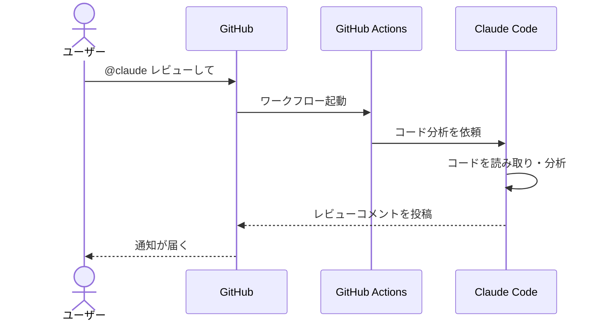

## はじめに

PRを出すたびに「誰かレビューしてくれないかな」と待つ。
Issueが溜まると、どれから手をつけるか考えるだけで時間が消える。

個人開発だと、レビューしてくれる人がそもそもいない。
チーム開発だと、レビュー待ちがボトルネックになる。

**この記事で解決すること：**
GitHub上のPRやIssueに `@claude` とメンションするだけで、Claude Codeが自動でレビュー・コード修正・Issue対応をしてくれる仕組みを作る。


:::message
**この記事の前提**
- GitHubアカウントを持っていること
- Claude Codeを使ったことがある（[インストールガイド](claude-code-windows-install-guide)参照）
- 「PRって何？」という方は、記事中の用語説明を参照

**料金について**
- GitHub Actions連携には **Anthropic APIキー**（従量課金）が必要
- Claude Pro/Maxサブスクリプションでは使えない（APIは別契約）
- APIの料金目安：1回のレビューで数セント〜数十セント程度（コードの量による）
- [Anthropic API 料金ページ](https://www.anthropic.com/pricing)で最新の単価を確認できる
:::

:::message
**検証環境**: Windows 11 / Claude Code / GitHub（2026年2月時点）
:::

---

## 用語説明

この記事で使う言葉を先に説明しておく。

| 用語 | 意味 |
|------|------|
| PR（Pull Request） | GitHubでコードの変更を提案する仕組み。「このコード、取り込んでいいですか？」という依頼書のようなもの |
| Issue | GitHubの「やること管理」機能。バグ報告や機能リクエストを記録する |
| GitHub Actions | GitHubに組み込まれた自動化ツール。「PRが来たら○○する」といったルールを設定できる |
| ワークフロー | GitHub Actionsで実行する自動化の手順書。YAMLファイルで書く |
| YAML（ヤムル） | 設定ファイルの書き方の一種。インデント（字下げ）で階層を表す |
| Secrets（シークレッツ） | GitHubに安全に保存できる秘密情報。APIキーなどを入れておく金庫のようなもの |
| トリアージ | 優先度をつけて分類すること。病院の救急で患者を振り分けるのと同じ意味 |

---

## GitHub Actions 連携とは

### claude-code-action

Anthropicが公式に提供している GitHub Action。リポジトリに設定するだけで、Claude CodeがGitHub上で動くようになる。

**できること：**

| 機能 | 説明 |
|------|------|
| PRレビュー | コードの問題点を指摘し、改善提案をコメント |
| コード修正 | バグ修正や機能実装をして、修正コミットを作成 |
| Issue対応 | Issueの内容を読み取り、修正PRを自動作成 |
| トリアージ | Issueにラベルを付けて分類 |

:::message
**公式ドキュメント**
- [English: GitHub Actions](https://docs.anthropic.com/en/docs/claude-code/github-actions)
- [日本語: GitHub Actions](https://docs.anthropic.com/ja/docs/claude-code/github-actions)
:::

### ローカルレビューとの違い

既存記事「[Claude Code でAIにコードを書かせてAIにレビューさせる](claude-code-ai-review-workflow)」では、ローカルPC上でサブエージェントを使ったレビューを紹介した。

今回の GitHub Actions 連携は、それとは別のアプローチ。

| 項目 | ローカル（サブエージェント） | GitHub Actions |
|------|--------------------------|----------------|
| 実行場所 | 自分のPC | GitHubのクラウド |
| トリガー | 手動で `/review` | PRやIssueへのメンション |
| 対象 | 個人作業中のチェック | チーム全体のワークフロー |
| 料金 | Claude Pro/Maxに含まれる | Anthropic API（従量課金） |
| 向いている場面 | コミット前の品質チェック | PR単位の自動レビュー |

**どちらが良いか？**
両方使うのがベスト。ローカルでチェックしてからPRを出し、GitHub Actions で二重チェックする流れが理想的。

---

## セットアップ方法

### ワンコマンドセットアップ（推奨）

Claude Codeのターミナルで以下を実行する。

```
/install-github-app
```

このコマンドを実行すると、対話形式でセットアップが進む。

1. Claude GitHub App のインストール（ブラウザが開く）
2. 対象リポジトリの選択
3. GitHub Secrets への APIキー登録
4. ワークフローファイルの自動生成

:::message
**`/install-github-app` とは**
Claude Code に組み込まれたセットアップコマンド。GitHub App のインストールからワークフローファイルの作成まで、必要な手順をガイドしてくれる。
:::

:::message alert
**APIキーについて**
セットアップにはAnthropicのAPIキーが必要。[Anthropic Console](https://console.anthropic.com/)でAPIキーを発行しておくこと。Claude Pro/Maxのサブスクリプションとは別の契約になる。
:::

### 手動セットアップ

`/install-github-app` がうまく動かない場合、手動でセットアップする。

#### Step 1: Claude GitHub App をインストール

1. ブラウザで [https://github.com/apps/claude](https://github.com/apps/claude) にアクセス
2. 「Install」をクリック
3. 対象のリポジトリを選択（「All repositories」または個別に選択）
4. 「Install」をクリック

#### Step 2: APIキーを GitHub Secrets に追加

1. GitHubでリポジトリのページを開く
2. 「Settings」タブをクリック
3. 左メニューの「Secrets and variables」 → 「Actions」を選択
4. 「New repository secret」をクリック
5. 以下を入力して「Add secret」をクリック

| 項目 | 入力内容 |
|------|----------|
| Name | `ANTHROPIC_API_KEY` |
| Secret | Anthropic ConsoleでコピーしたAPIキー |

:::message alert
**APIキーの取り扱い**
APIキーは絶対にコードに直接書かない。必ずGitHub Secretsに保存する。GitHub Secretsに保存した値は、ログやPR上に表示されない仕組みになっている。
:::

#### Step 3: ワークフローファイルを作成

リポジトリのルートに `.github/workflows/claude.yml` を作成する。

```yaml
name: Claude Code

on:
  issue_comment:
    types: [created]
  pull_request_review_comment:
    types: [created]
  issues:
    types: [opened]

jobs:
  claude:
    if: |
      (github.event_name == 'issue_comment' && contains(github.event.comment.body, '@claude')) ||
      (github.event_name == 'pull_request_review_comment' && contains(github.event.comment.body, '@claude')) ||
      (github.event_name == 'issues' && contains(github.event.issue.body, '@claude'))
    runs-on: ubuntu-latest
    permissions:
      contents: read
      pull-requests: write
      issues: write
      id-token: write
    steps:
      - name: Run Claude Code
        uses: anthropics/claude-code-action@beta
        with:
          anthropic_api_key: ${{ secrets.ANTHROPIC_API_KEY }}
```

:::message
**YAMLファイルの読み方**
- `on:` の下に「いつ動くか」（トリガー）を書く
- `jobs:` の下に「何をするか」（処理内容）を書く
- `if:` の条件で「`@claude`」を含むコメントだけに反応するように制限している
- インデント（字下げ）が重要。スペース2つで階層を表す
:::

---

## `@claude` の使い方

セットアップが完了したら、PRやIssueのコメント欄に `@claude` と書くだけで使える。

### 基本的なメンション例

```
@claude このPRをレビューして
```

```
@claude このコンポーネントのTypeErrorを修正して
```

```
@claude この機能を実装して
```

```
@claude このIssueの内容をもとにPRを作成して
```

### 動作の流れ



Claude Codeはリポジトリのコードを読み取り、分析結果をPRやIssueにコメントとして投稿する。コード修正が必要な場合は、新しいコミットを作成してPRに追加する。

---

## 実践パターン

### パターン1：PR自動レビュー

PRが作成されたときに、自動でレビューを実行する設定。

```yaml
name: Claude PR Review

on:
  pull_request:
    types: [opened, synchronize]

jobs:
  review:
    runs-on: ubuntu-latest
    permissions:
      contents: read
      pull-requests: write
      id-token: write
    steps:
      - name: Review PR
        uses: anthropics/claude-code-action@beta
        with:
          anthropic_api_key: ${{ secrets.ANTHROPIC_API_KEY }}
          direct_prompt: |
            このPRの変更内容をレビューしてください。
            以下の観点でチェックしてください：
            - バグの可能性
            - セキュリティリスク
            - コードの読みやすさ
          allowed_tools: |
            Bash(git diff:*)
            Bash(git log:*)
            Bash(git show:*)
            Read
            Grep
            Glob
```

:::message
**`allowed_tools` とは**
Claude Codeが使えるツール（機能）を制限する設定。上の例では、ファイルの読み取りとGitコマンドだけを許可している。ファイルの書き込みや編集は許可していないので、レビューだけして勝手にコードを変更する心配がない。
:::

### パターン2：Issue自動トリアージ

新しいIssueが作成されたとき、自動で分類してラベルを付ける設定。

```yaml
name: Claude Issue Triage

on:
  issues:
    types: [opened]

jobs:
  triage:
    runs-on: ubuntu-latest
    permissions:
      contents: read
      issues: write
      id-token: write
    steps:
      - name: Triage Issue
        uses: anthropics/claude-code-action@beta
        with:
          anthropic_api_key: ${{ secrets.ANTHROPIC_API_KEY }}
          direct_prompt: |
            このIssueを分析して、適切なラベルを付けてください：
            - bug: バグ報告の場合
            - enhancement: 機能要望の場合
            - question: 質問の場合

            また、優先度も判定してください：
            - priority:high: 緊急度が高い
            - priority:medium: 通常
            - priority:low: 後回しでよい
          allowed_tools: |
            Bash(gh issue edit:*)
            Bash(gh label create:*)
            Read
            Grep
            Glob
```

### パターン3：CLAUDE.md でプロジェクト固有のルールを適用

リポジトリに `CLAUDE.md` を置いておくと、Claude Codeがそのルールに従って動作する。ローカルで使うときと同じ仕組み。

```markdown
# プロジェクトルール

## コーディング規約
- TypeScript を使用する
- 関数は50行以内に収める
- テストを必ず書く

## レビュー基準
- セキュリティチェックを最優先
- パフォーマンスへの影響を確認
- 既存テストが通ることを確認
```

:::message
**CLAUDE.md について**
CLAUDE.mdはClaude Codeへの指示書。プロジェクトのルールや規約を書いておくと、Claude Codeがそれに従って動いてくれる。詳しくは「[CLAUDE.mdで別人にする](claude-code-claude-md)」を参照。
:::

### パターン4：定期メンテナンス（cron）

週に1回、自動で依存関係のチェックや古いIssueの棚卸しを実行する設定。

```yaml
name: Claude Weekly Maintenance

on:
  schedule:
    - cron: '0 9 * * 1'  # 毎週月曜 9:00 UTC（日本時間 18:00）

jobs:
  maintenance:
    runs-on: ubuntu-latest
    permissions:
      contents: read
      issues: write
      pull-requests: write
      id-token: write
    steps:
      - name: Weekly Check
        uses: anthropics/claude-code-action@beta
        with:
          anthropic_api_key: ${{ secrets.ANTHROPIC_API_KEY }}
          direct_prompt: |
            以下のメンテナンスタスクを実行してください：
            1. package.json の依存関係に既知の脆弱性がないかチェック
            2. 30日以上更新のないIssueをリストアップ
            3. 結果をIssueとして報告
```

:::message
**cronの読み方**
`0 9 * * 1` は「毎週月曜の9:00 UTC」を意味する。日本時間では18:00。GitHub Actionsのスケジュールは常にUTC（協定世界時）で指定する。
:::

---

## セキュリティの注意点

GitHub Actions でClaude Codeを使うときは、セキュリティに気をつける必要がある。

### 必ず守ること

| ルール | 理由 |
|--------|------|
| APIキーはGitHub Secretsで管理 | コードに直接書くと、リポジトリを見た人全員に漏れる |
| `allowed_tools` でツールを制限 | 不要な権限を与えない（最小権限の原則） |
| 公開リポジトリでは `show_full_output` を無効に | Claude Codeの全出力がGitHub上に表示され、機密情報が漏れる可能性がある |

### 誰がアクションを起動できるか

デフォルトでは、**リポジトリに書き込み権限を持つユーザー**のみが `@claude` メンションでアクションを起動できる。外部の人がコメントしても起動しない。

これは、悪意のあるプロンプト（指示）を送り込まれるリスクを防ぐための仕組み。

### プロンプトインジェクション対策

Issueの本文やPRの説明文にはHTMLを埋め込めるため、Claude Codeへの不正な指示を仕込まれる可能性がある。公式では以下の対策が推奨されている。

- Issueテンプレートを使い、自由入力を制限する
- `allowed_tools` でファイル書き込みを禁止したレビュー専用ワークフローを用意する

:::message
**公式ドキュメント**
- [English: Security best practices](https://docs.anthropic.com/en/docs/claude-code/github-actions#security-best-practices)
- [日本語: セキュリティのベストプラクティス](https://docs.anthropic.com/ja/docs/claude-code/github-actions#security-best-practices)
:::

---

## コスト管理

API従量課金なので、意図しない大量実行を防ぐ設定が重要。

### `max_turns` でターン数を制限

```yaml
- name: Run Claude Code
  uses: anthropics/claude-code-action@beta
  with:
    anthropic_api_key: ${{ secrets.ANTHROPIC_API_KEY }}
    max_turns: "10"
```

`max_turns` は、Claude Codeが1回の実行で行う対話のターン数の上限。数値を小さくするとコストを抑えられるが、複雑なタスクは完了しないことがある。

| 用途 | 推奨 max_turns |
|------|----------------|
| レビューのみ | 5〜10 |
| バグ修正 | 10〜20 |
| 機能実装 | 20〜30 |

### ワークフローのタイムアウト

```yaml
jobs:
  claude:
    runs-on: ubuntu-latest
    timeout-minutes: 30
```

万が一Claude Codeが処理を続けてしまった場合に、30分で強制終了する設定。

### 並列実行の制限

```yaml
concurrency:
  group: claude-${{ github.event.issue.number || github.event.pull_request.number }}
  cancel-in-progress: true
```

同じPRやIssueに対して複数のClaudeが同時に動くことを防ぐ。新しいメンションが来たら、前の実行をキャンセルする。

:::message
**コストの目安**
具体的なコストはコードの量やタスクの複雑さによるが、一般的なPRレビューで数セント〜数十セント程度。月額数ドル〜数十ドルの範囲に収まることが多い。[Anthropic API 料金ページ](https://www.anthropic.com/pricing)で最新の単価を確認すること。
:::

---

## まとめ

| 項目 | 内容 |
|------|------|
| 何ができるか | PRレビュー、Issue対応、コード修正の自動化 |
| セットアップ | `/install-github-app` で簡単セットアップ |
| 使い方 | `@claude` とメンションするだけ |
| 料金 | Anthropic API 従量課金（Pro/Maxとは別） |
| セキュリティ | GitHub Secrets + `allowed_tools` + 書き込み権限制限 |
| コスト管理 | `max_turns` + タイムアウト + 並列実行制限 |

**ローカルのサブエージェントレビューと組み合わせると、二重チェック体制が作れる。**

1. コード作成中 → ローカルで `/review`（[サブエージェント方式](claude-code-ai-review-workflow)）
2. PR作成後 → GitHub上で `@claude` が自動レビュー（この記事の方法）

この2段構えにすることで、個人開発でもチーム開発並みの品質管理ができる。

---

## 参考リンク

:::message
**公式ドキュメント**
- [English: GitHub Actions - Claude Code Docs](https://docs.anthropic.com/en/docs/claude-code/github-actions)
- [日本語: GitHub Actions - Claude Code ドキュメント](https://docs.anthropic.com/ja/docs/claude-code/github-actions)
- [claude-code-action リポジトリ（GitHub）](https://github.com/anthropics/claude-code-action)
- [Anthropic API 料金](https://www.anthropic.com/pricing)

ブラウザの翻訳機能を使えば、英語ドキュメントも日本語で読める。
:::

---

## 関連記事

- [Claude Code インストールガイド（Windows）](claude-code-windows-install-guide)
- [Claude Code 便利機能まとめ：使いこなすためのTips](claude-code-tips-and-features)
- [Claude Code が動かない時に見るページ（Windows）](claude-code-windows-troubleshoot)
- [Claude Code でAIにコードを書かせてAIにレビューさせる](claude-code-ai-review-workflow)
