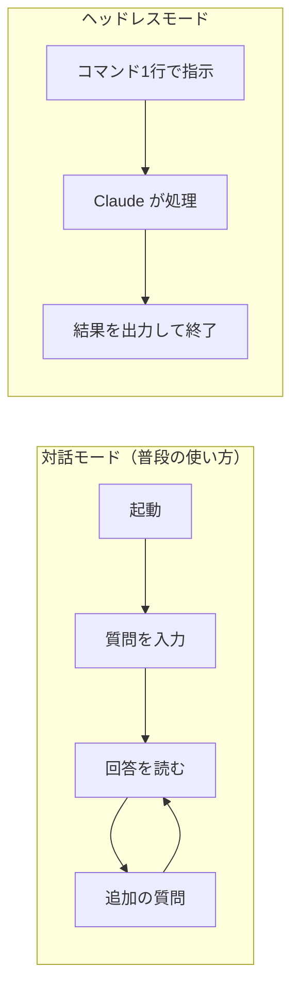

## はじめに

Claude Codeを使っていて、こんな場面に心当たりはないだろうか。

- テストを実行して結果を教えて、と毎回手動で頼んでいる
- ビルドエラーが出るたびにログをコピペして「これ何？」と聞いている
- コミットメッセージを考えるのが面倒で、毎回Claudeに会話しながら作っている

一つひとつは数分で終わる作業だが、積み重なると相当な時間を取られる。

実は、Claude Codeには **ヘッドレスモード** という機能がある。対話なしで指示を実行し、結果だけを返してくれるモードだ。スクリプトやCI（自動テストの仕組み）に組み込めるので、**自分がPCの前にいなくてもClaude Codeが働いてくれる**。

この記事では、ヘッドレスモードの基本から実践パターンまでを解説する。

:::message
**公式ドキュメント**
- [English: CLI Usage](https://code.claude.com/docs/en/cli-usage)
- [日本語: CLI の使用方法](https://code.claude.com/docs/ja/cli-usage)
:::

:::message
**前提**
- Claude Codeがインストール済みであること（[インストールガイドはこちら](claude-code-windows-install-guide)）
- ターミナル（PowerShell / bash）の基本操作ができること
- API従量課金、またはMax 5x以上のプラン（ヘッドレスモード自体は全プランで使える）
:::

---

## ヘッドレスモードとは

普段のClaude Codeは **対話モード**。ターミナルでClaude Codeを起動し、チャット形式でやり取りする。

ヘッドレスモードは、**対話なしで指示を実行し、結果を出力して終了する**モード。



**使い分け**：

| | 対話モード | ヘッドレスモード |
|---|-----------|----------------|
| 起動方法 | `claude` | `claude -p "指示"` |
| やり取り | チャット形式 | 一方通行 |
| 終了 | 自分で `/exit` | 自動終了 |
| 向いている場面 | 試行錯誤が必要な作業 | 決まった作業の自動化 |

`-p` は `--print` の略。「結果を出力（print）して終わる」という意味。

---

## 基本的な使い方

### 単発の指示

最もシンプルな使い方。ターミナルに1行打つだけ。

```bash
claude -p "このプロジェクトの構成を説明して"
```

Claude Codeが結果を出力して、自動的に終了する。対話に入らない。

### ファイルの内容を渡す

パイプ（`|`）を使うと、ファイルの中身をClaude Codeに直接渡せる。

```bash
cat error.log | claude -p "このエラーの原因を分析して"
```

:::message
**パイプ（`|`）とは**
あるコマンドの出力を、次のコマンドの入力につなげる記号。`cat error.log` でファイルの中身を表示し、その結果を `claude -p` に渡している。
:::

### 結果をファイルに保存する

`>` を使うと、Claude Codeの出力をファイルに保存できる。

```bash
claude -p "READMEを作成して" > README.md
```

画面に結果は表示されないが、`README.md` に保存される。

### 前の会話の続きから実行する

`-c`（`--continue`）フラグを付けると、直前の会話を引き継いで実行する。

```bash
claude -p "テスト結果を分析して"
# （結果を見て、もう少し詳しく知りたい場合）
claude -c -p "失敗しているテストだけ詳細に説明して"
```

特定のセッションを再開したい場合は `-r`（`--resume`）を使う。

```bash
claude -r SESSION_ID -p "前回の続きで修正して"
```

:::message
**公式ドキュメント**
- [English: CLI Usage](https://code.claude.com/docs/en/cli-usage)
- [日本語: CLI の使用方法](https://code.claude.com/docs/ja/cli-usage)
:::

---

## 出力形式を選ぶ

ヘッドレスモードの出力形式は4種類。用途に応じて使い分ける。

### text（デフォルト）

人間が読むための普通のテキスト。特に指定しなければこれが使われる。

```bash
claude -p "このコードを説明して"
```

### json（スクリプト向け）

プログラムで結果を処理したい場合に使う。コスト情報やセッションIDなどのメタデータも含まれる。

```bash
claude -p "このコードを説明して" --output-format json
```

出力例：

```json
{
  "type": "result",
  "result": "このコードは...",
  "cost_usd": 0.003,
  "session_id": "abc123",
  "is_error": false
}
```

`cost_usd`（かかった費用）が含まれるので、コスト管理にも使える。

### stream-json（リアルタイム処理向け）

処理の途中経過をリアルタイムで受け取りたい場合。各イベントが1行ずつJSON形式で出力される。

```bash
claude -p "大きなファイルを分析して" --output-format stream-json
```

### 構造化出力（JSON Schema）

「決まった形式で結果がほしい」場合に使う。`--output-format json` と `--json-schema` を組み合わせる。

```bash
claude -p "このコードのバグを列挙して" \
  --output-format json \
  --json-schema '{"type":"object","properties":{"bugs":{"type":"array","items":{"type":"object","properties":{"file":{"type":"string"},"line":{"type":"number"},"description":{"type":"string"}}}}}}'
```

Claudeの出力が指定した形式に従うようになる。たとえばバグ一覧なら「ファイル名・行番号・説明」のセットで返る。

:::message
**どれを使えばいいか迷ったら**
- 人間が読む → `text`（デフォルト、指定不要）
- スクリプトで処理する → `json`
- 最初は `text` で試して、自動化する段階で `json` に切り替えるのがおすすめ
:::

---

## 安全に使うための設定

ヘッドレスモードは人間の確認なしに実行されるため、**安全策を設定しておくことが重要**。

### 許可するツールを限定する

`--allowedTools` で、Claude Codeが使えるツール（機能）を明示的に指定する。

```bash
claude -p "コードレビューして" \
  --allowedTools "Read" "Grep" "Glob"
```

この例では「ファイルの読み取り」と「検索」だけを許可している。ファイルの書き換えやコマンド実行はできない。

**よく使うツールの組み合わせ**：

| やりたいこと | 許可するツール |
|-------------|---------------|
| コードを読んで分析 | `Read`, `Grep`, `Glob` |
| ファイルを編集 | `Read`, `Write`, `Edit` |
| Gitコマンドを使う | `Bash(git diff *)`, `Bash(git commit *)` |
| 全部許可（注意） | 指定なし（デフォルト） |

:::message
`Bash(git diff *)` のように、`Bash()` の中にコマンドのパターンを書くと、**そのコマンドだけ**を許可できる。ワイルドカード `*` を使えば引数の違いも吸収できる。
:::

### ターン数を制限する

`--max-turns` で、Claudeが処理を繰り返せる回数を制限する。

```bash
claude -p "テストを実行して結果を報告して" --max-turns 5
```

ターンとは「Claudeが1回考えて行動する」サイクルのこと。たとえば「ファイルを読む → テストを実行 → 結果を確認 → 報告」で4ターン。上限に達すると、それまでの結果を出力して終了する。

暴走防止に有効。迷ったら `--max-turns 10` から始めるとよい。

### コスト上限を設定する

`--max-budget-usd` で、1回の実行で使える金額の上限を設定する。

```bash
claude -p "プロジェクト全体を分析して" --max-budget-usd 1.0
```

この例では1ドル（約150円）を超えたら処理を停止する。寝ている間に大量課金される心配がなくなる。

:::message alert
**コスト上限は必ず設定しよう**
ヘッドレスモードは人間の確認なしに動くので、タスクが複雑だとトークン消費が膨らむことがある。`--max-budget-usd` を設定しておけば、想定外の課金を防げる。コスト管理の詳細は[こちらの記事](claude-code-cost-management)を参照。
:::

### パーミッションモードを指定する

`--permission-mode` で、Claude Codeの権限レベルを切り替える。

| モード | 内容 | 用途 |
|--------|------|------|
| `plan` | ファイルの読み取りのみ（変更不可） | 分析・レビュー |
| `bypassPermissions` | すべての権限チェックをスキップ | コンテナ内のみ |

```bash
# 読み取り専用で安全に分析
claude -p "セキュリティ上の問題点を分析して" --permission-mode plan
```

**`plan` モードはヘッドレスモードと相性が良い**。ファイルを変更されたくない分析タスクでは積極的に使おう。

### 危険なオプション：`--dangerously-skip-permissions`

すべての権限チェックを無効化するオプション。**CI/CDパイプラインやDockerコンテナなど、隔離された環境でのみ使用すること**。

```bash
# ⚠️ 隔離環境（Docker等）でのみ使用
claude -p "ビルドして" --dangerously-skip-permissions
```

:::message alert
**ローカル環境では絶対に使わない**
このオプションを使うと、Claude Codeがファイルの削除やシステムコマンドの実行を確認なしで行える。間違えて使うと取り返しのつかない変更が起きる可能性がある。
:::

:::message
**公式ドキュメント**
- [English: Headless Mode (CI)](https://code.claude.com/docs/en/cli-usage#headless-mode-ci)
- [日本語: ヘッドレスモード (CI)](https://code.claude.com/docs/ja/cli-usage#headless-mode-ci)
:::

---

## 実践パターン

ここからは具体的なユースケースを紹介する。コピペして使える形にしてある。

### パターン1：ビルドエラーの自動分析

ビルド（プログラムの変換処理）でエラーが出た時、ログを渡して原因を分析してもらう。

```bash
cat build-error.txt | claude -p "このビルドエラーの原因と修正方法を教えて" > analysis.txt
```

結果は `analysis.txt` に保存される。あとから落ち着いて読める。

### パターン2：コミットメッセージの自動生成

ステージング済み（`git add` 済み）の変更から、適切なコミットメッセージを作成して自動コミットする。

```bash
claude -p "ステージされた変更の内容を確認して、適切なコミットメッセージで英語でコミットして" \
  --allowedTools "Bash(git diff *)" "Bash(git commit *)"
```

`--allowedTools` で `git diff` と `git commit` だけを許可しているので、それ以外の操作はされない。

### パターン3：コードレビューの自動化

GitHub のプルリクエスト（コード変更の提案）をセキュリティ観点でレビューする。

```bash
gh pr diff 123 | claude -p "セキュリティ観点でレビューして。問題があれば重要度と修正提案を含めて" \
  --output-format json
```

:::message
`gh` は GitHub CLI（GitHubをターミナルから操作するツール）。`gh pr diff 123` でプルリクエスト #123 の差分を取得する。
:::

### パターン4：定期レポートの生成

プロジェクトの状況レポートを自動生成する。スケジューラー（Windowsのタスクスケジューラなど）と組み合わせれば、毎朝自動で最新レポートが生成される。

```bash
claude -p "このプロジェクトの現在の状況をまとめて。未解決の問題、最近の変更、次にやるべきことを含めて" \
  --max-turns 10 \
  --max-budget-usd 0.50 \
  > daily-report.txt
```

### パターン5：複数ファイルの一括処理

特定のパターンに該当するファイルを一括処理する例。

```bash
# テストファイルをすべて分析してカバレッジの改善提案を得る
find . -name "*.test.ts" | head -5 | while read f; do
  echo "=== $f ===" >> test-review.txt
  cat "$f" | claude -p "このテストの改善点を教えて" >> test-review.txt
done
```

:::message alert
**一括処理はコストに注意**
ファイルの数だけClaude Codeが起動するので、トークン消費が大きくなる。まず1-2ファイルで試してから、全体に適用すること。
:::

---

## 環境変数

ヘッドレスモードで使う主な環境変数。スクリプトやCI環境で設定しておくと便利。

| 環境変数 | 説明 | 設定例 |
|---------|------|--------|
| `ANTHROPIC_API_KEY` | APIキー（Max プランなら不要） | `sk-ant-...` |
| `ANTHROPIC_MODEL` | 使用モデルの変更 | `claude-sonnet-4-20250514` |
| `DISABLE_AUTOUPDATER` | 自動更新を無効化（CI向け） | `1` |
| `CLAUDE_CODE_DISABLE_NONESSENTIAL_TRAFFIC` | テレメトリ（利用状況の送信）を無効化 | `1` |

:::message
**環境変数とは**
OSに設定する「名前=値」の組み合わせ。アプリが動く時に自動で読み込まれる。ターミナルで一時的に設定するには：

```bash
# bash / PowerShell(bash互換)
export ANTHROPIC_MODEL="claude-sonnet-4-20250514"

# PowerShell
$env:ANTHROPIC_MODEL = "claude-sonnet-4-20250514"
```
:::

:::message
**公式ドキュメント**
- [English: CLI Usage - Configuration](https://code.claude.com/docs/en/cli-usage#configuration)
- [日本語: CLI の使用方法 - 設定](https://code.claude.com/docs/ja/cli-usage#configuration)
:::

---

## システムプロンプトのカスタマイズ

ヘッドレスモードでは、Claudeに渡すシステムプロンプト（Claudeの振る舞いを決める裏の指示）をカスタマイズできる。

### 追記する（推奨）

`--append-system-prompt` で、デフォルトのシステムプロンプトに追記する。

```bash
claude -p "コードレビューして" \
  --append-system-prompt "セキュリティの問題を最優先で報告すること。日本語で回答すること。"
```

デフォルトのシステムプロンプト（Claude Codeの標準的な振る舞い）はそのまま残るので、**基本的にはこちらを使う**。

### 完全に置き換える

`--system-prompt` で、システムプロンプトを丸ごと置き換える。

```bash
claude -p "レビューして" \
  --system-prompt "あなたはセキュリティ専門のコードレビュアーです。脆弱性のみを報告してください。"
```

Claude Codeのデフォルトの振る舞いがすべて消えるので、**特殊な用途でのみ使う**。

---

## まとめ：やりたいこと別コマンド早見表

| やりたいこと | コマンド |
|-------------|---------|
| 単発の質問 | `claude -p "質問"` |
| ファイルを渡して分析 | `cat file \| claude -p "分析して"` |
| 結果をファイルに保存 | `claude -p "指示" > output.txt` |
| 前の会話の続き | `claude -c -p "続きの指示"` |
| JSON形式で出力 | `claude -p "指示" --output-format json` |
| 読み取り専用で実行 | `claude -p "指示" --permission-mode plan` |
| ツールを限定 | `claude -p "指示" --allowedTools "Read" "Grep"` |
| ターン数を制限 | `claude -p "指示" --max-turns 10` |
| コスト上限を設定 | `claude -p "指示" --max-budget-usd 1.0` |
| システムプロンプト追記 | `claude -p "指示" --append-system-prompt "追記"` |

**安全に使うための3点セット**（迷ったらこの3つを付ける）：

```bash
claude -p "指示" \
  --max-turns 10 \
  --max-budget-usd 1.0 \
  --allowedTools "Read" "Grep" "Glob"
```

---

## 参考リンク

:::message
**公式ドキュメント**
- [English: CLI Usage](https://code.claude.com/docs/en/cli-usage)
- [日本語: CLI の使用方法](https://code.claude.com/docs/ja/cli-usage)
- [English: Headless Mode (CI)](https://code.claude.com/docs/en/cli-usage#headless-mode-ci)
- [日本語: ヘッドレスモード (CI)](https://code.claude.com/docs/ja/cli-usage#headless-mode-ci)
- [English: Best Practices](https://code.claude.com/docs/en/best-practices)
:::

## 関連記事

- [Claude Code インストールガイド（Windows）](claude-code-windows-install-guide)
- [Claude Code 便利機能まとめ：使いこなすためのTips](claude-code-tips-and-features)
- [Claude Code が動かない時に見るページ（Windows）](claude-code-windows-troubleshoot)
- [Claude Codeの請求額を見て青ざめた人へ贈るコスト管理術](claude-code-cost-management)
- [Claude Codeが勝手にファイルを消した日から、権限設定を真剣にやるようになった](claude-code-permissions)
- [Claude CodeをGitHubに住まわせたら、PRレビューが自動化された](claude-code-github-actions-guide)
