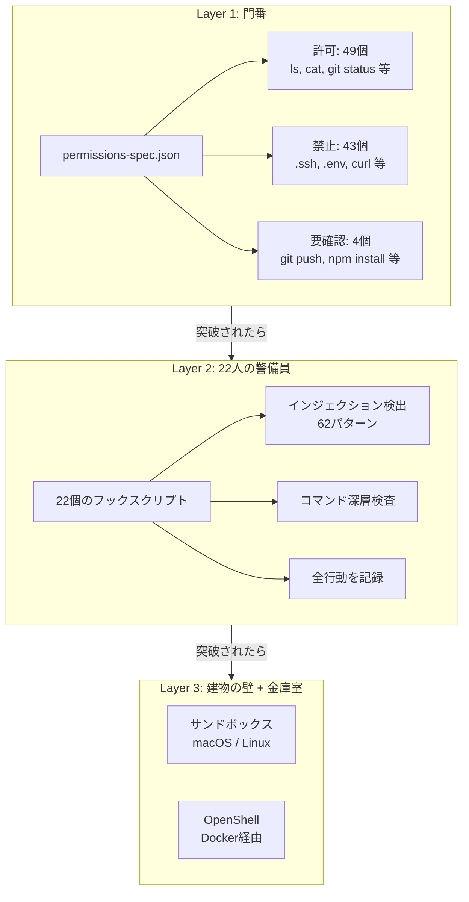

## 「許可しますか？」に疲れていないか

Claude Code を使い始めて、最初に感じたのは便利さじゃなくて煩わしさだった。

「このコマンドを実行しますか？」「このファイルを編集しますか？」。何をするにも確認ダイアログが出る。最初は丁寧に読んで判断していた。でも5回、10回と繰り返すうちに、内容を読まずに「y」を押すようになった。

これが **承認疲れ** だ。

セキュリティの世界では古くから知られている現象で、人間は繰り返しの確認に耐えられない。「本当に削除しますか？」を100回聞かれたら、101回目は読まずにOKを押す。ブラウザの証明書警告を無視するのと同じ。

かといって `--dangerously-skip-permissions` で確認を全部飛ばすのは、名前の通り危険すぎる。Claude Code が `.ssh` ディレクトリの鍵を読んだり、`curl` で外部にデータを送信したり、そういう操作まで無条件で通してしまう。

**承認を続けるのも疲れる。全部許可するのも怖い。** このジレンマを解決するために、shield-harness を作った。

:::message
**公式ドキュメント**
- [English: Permission modes](https://code.claude.com/docs/en/permissions)
- [日本語: 権限モード](https://code.claude.com/docs/ja/permissions)
:::

## shield-harness は何をするのか

GitHub: https://github.com/Sora-bluesky/shield-harness

https://github.com/Sora-bluesky/shield-harness

:::message
この記事は shield-harness v0.4.0（2026年3月時点）に基づいている。バージョンアップでフック数やルール数は変わる可能性がある。
:::

ひとことで言うと、**人間の代わりにセキュリティ判断をする自動防御システム**。

Claude Code には「フック」という仕組みがある。Claude が何かを実行するたびに、事前に設定したチェック処理を自動で挟む機能だ。shield-harness はこのフックを22個まとめて提供する。

22人の警備員が、Claude の行動を24時間リアルタイムで見張っている。人間が「許可しますか？」に答える代わりに、警備員たちがルールに基づいて自動で判断する。

外部ライブラリは不要。Claude Code が動いている環境なら追加で何かをインストールする必要はない。導入はこれだけ。

```bash
npx shield-harness init
```

あとは普通に `claude` を起動すれば、フックが裏で自動的に動き始める。

:::message
**公式ドキュメント**
- [English: Hooks](https://code.claude.com/docs/en/hooks)
- [日本語: フック](https://code.claude.com/docs/ja/hooks)
:::

## 4つの防御レイヤー

shield-harness は4層の防御で安全を確保する。それぞれの役割を、建物のセキュリティに例えて説明する。



### Layer 1: 門番（permissions-spec.json）

建物の入口に立つ門番。「この人は通していい」「この人はダメ」を名簿で判断する。

shield-harness には、あらかじめ仕分けされたルールが96個入っている。

| 分類 | 数 | 具体例 |
|------|-----|--------|
| 許可（通していい） | 49個 | `ls`, `cat`, `git status`, `echo` |
| 禁止（絶対ダメ） | 43個 | `.ssh` アクセス, `.env` 読み取り, `curl`, `wget` |
| 要確認（人間に聞く） | 4個 | `git push`, `npm install`, `docker run` |

たとえば `cat README.md`（ファイルの中身を表示するだけ）は無条件で通す。`curl https://外部サイト`（ネットワーク通信）は即ブロック。`git push`（コードを公開リポジトリに送信）は、念のため人間に確認を取る。

承認ダイアログが出るのは4種類だけ。96個のうちの4個。これなら疲れない。最初にこの数字を見たとき、正直ホッとした。

### Layer 2: 22人の警備員（フック）

門番をすり抜けてくる危険もある。だから、中身をもっと細かくチェックする検査官が22人いる。

なぜ2段構えなのか。門番は「コマンド名」しか見ていない。`sed` は許可リストに入っている。テキストを置換するだけのコマンドだから。でも `sed -i` と書くとファイルを直接書き換える操作になる。門番はこの違いを見抜けない。

22人の警備員は、コマンドの**中身**まで検査する。

やっていること:

- `sed -i` のような、許可コマンドの危険なオプションを検出
- AI をだまして危険な操作をさせる攻撃（インジェクション）を62パターンで検出
- shield-harness 自身の設定ファイルを改ざんする操作をブロック（自己保護）
- すべての判断をログに記録。後から「何が起きたか」を追跡できる

この62パターン、最初は「こんなに攻撃手法があるのか」と引いた。でも知らないより知って防いでいるほうがマシだ。最後のログ記録は地味だけど大事で、何かおかしなことが起きたとき「いつ、どのコマンドが、なぜブロックされたか」を全部確認できる。

### Layer 3: 建物の壁（サンドボックス）

ここは Claude Code が内蔵しているサンドボックス機能。特定のフォルダ外への書き込みを禁止する、OS レベルの防御壁。

ただし、**Windows 単体では機能しない**。macOS と Linux 向けの機能だ。（この点は後述する）

### Layer 3b: 金庫室（OpenShell）

Windows ユーザーにとって一番の注目ポイント。

OpenShell は NVIDIA が開発した、AI エージェントを安全な隔離空間に閉じ込めるためのツール。Docker Desktop（パソコンの中に隔離された作業空間を作るソフト）の上で動く。

Layer 1-2 が「コマンドのテキストを見てパターンマッチ」しているのに対し、OpenShell は**プロセスそのものを OS レベルで制御**する。テキストを読んで判断するのではなく、OS が直接ブロックする。

Windows で OS レベルのサンドボックスがない弱点を補える、現時点で唯一の選択肢だと思っている。ただし Docker Desktop の導入が前提になるので、そこはハードルがある。

:::message
Docker Desktop は個人利用なら無料。会社で使う場合は従業員数によって有料プランが必要になることがある（2026年3月時点）。
:::

## Windows ユーザーは何が使えるのか

ここをはっきりさせておく。

| レイヤー | Windows 対応 | 備考 |
|---------|-------------|------|
| Layer 1: 門番 | 動く | 完全動作 |
| Layer 2: 22人の警備員 | 動く | 完全動作 |
| Layer 3: サンドボックス | **動かない** | macOS / Linux 専用 |
| Layer 3b: OpenShell | 動く | Docker Desktop + WSL2 が必要 |

Layer 1-2 だけでも、デフォルトの「毎回確認」より圧倒的に快適で安全になる。ただし、テキストパターンマッチの限界はある（後述）。

Windows 固有の攻撃パターンも検出対象に入っている。`.lnk`（ショートカットファイル偽装）、`.scf`（シェルコマンドファイル）、PowerShell の `-enc`（エンコードされたコマンド実行）、NTFS ADS（ファイルの裏に別のデータを隠す Windows 固有の仕組み）。Windows ユーザーが忘れがちな攻撃経路を、ちゃんとカバーしている。

## 他の安全策と比べてどうなのか

| 方法 | 安全性 | 手軽さ | 自律運転 |
|------|--------|--------|---------|
| デフォルト（毎回承認） | ○ | ◎ | × |
| acceptEdits | △ | ◎ | △ |
| permissions.allow | △ | ○ | △ |
| --dangerously-skip-permissions | × | ◎ | ◎ |
| **shield-harness** | ◎ | ○ | ◎ |

デフォルトは安全だけど自律運転できない。`--dangerously-skip-permissions` は自律運転できるけど安全じゃない。shield-harness は両方を成立させる。

手軽さが「◎」ではなく「○」なのは、Docker Desktop の導入や設定のカスタマイズが人を選ぶから。とはいえ `npx shield-harness init` 一発で始められるので、最初の敷居はそこまで高くない。

## デメリットと限界

shield-harness は万能じゃない。ここを隠すと不誠実なので、はっきり書く。

**1. パターンマッチの限界**

Layer 1-2 は「コマンドのテキスト」を見ている。`python -c "import os; os.remove('大事なファイル.txt')"` のような、プログラム言語の中に埋め込まれた破壊操作は検出できない場合がある。テキストを読んで判断する以上、この限界は構造的に避けられない。だから Layer 3b（OpenShell）が要る。

**2. フック実行のオーバーヘッド**

22個のフックが毎回動くので、わずかに遅くなる。数十ms から数百ms 程度。体感で気になったことは正直ない。

**3. 安全なコマンドまでブロックされることがある**

フックが慎重すぎて、問題のないコマンドまで止めてしまうことがある。特に strict プロファイルだと多め。自分のプロジェクトで頻繁に使うコマンドがブロックされるなら、`permissions-spec.json` のカスタマイズが要る。

**4. バージョンが若い**

v0.4.0（2026年3月時点）。僕のバージョン管理の問題で、設定形式が変わる可能性は十分ある。

**5. Claude Code のアップデートに追従が必要**

Claude Code 側の Hooks API が変わったとき、shield-harness も更新しないと防御に穴が開く。フック側が古いまま放置するのが一番危ない。

**6. Windows のサンドボックス不在は根本解決していない**

Layer 1-2 だけでは「テキストを見てブロック」が限界。OpenShell を使わない限り、テキストマッチの範囲外で起きる操作は素通りする。

**7. 設定の理解が必要**

デフォルトで十分使えるけど、プロジェクト固有の要件には `permissions-spec.json` のカスタマイズが要る。何が許可されていて何が禁止されているか、理解して使うのが前提。

:::message alert
**5番が一番怖い**。shield-harness を入れて安心した結果、Claude Code のアップデート後にフック側を更新し忘れて防御が効かなくなる。これは「承認疲れ」とは別の形の油断。自動進化機能（セッション開始時に最新バージョンをチェックして差分を適用する仕組み）は今後追加予定。それまでは GitHub リポジトリの Release を Watch しておくのをおすすめする。
:::

## プロファイル選択

導入時にプロファイルを選べる。

```bash
# 最低限の防御
npx shield-harness init --profile minimal

# 推奨（デフォルト）
npx shield-harness init --profile standard

# 最大防御
npx shield-harness init --profile strict
```

迷ったら standard でいい。strict は安全なコマンドまで止めることが多くて、それはそれでストレスになる。minimal はセキュリティに自信がある人向け。

## v1.0.0 → v0.1.0 ロールバックの話

少しだけ裏話をさせてほしい。

shield-harness を最初に作ったとき、「もう完成だ」と思って v1.0.0 をリリースした。直後に設計と実装の乖離を8件見つけた。たとえば `curl` が allow（許可）リストに入っていた。外部通信を許可しておいて「セキュリティツールです」は冗談にもならない。

自ら v0.1.0 にロールバックした。恥ずかしかったけど、壊れたまま v1.0.0 を名乗り続けるよりマシだった。

この失敗から、`permissions-spec.json` を4段階で検証する仕組みを作った。今の96個のルールは、この検証プロセスを通っている。失敗を隠すんじゃなくて、仕組みで再発を防ぐ。shield-harness の設計思想はここから生まれた。

## まとめ

Claude Code の「怖い」は、正体がはっきりしている。**防御がない状態で AI を自由にさせる怖さ**だ。

shield-harness は、22個のフックと96個のルールで、人間の代わりにセキュリティ判断を自動化する。承認ダイアログは4種類だけ。残りは全部自動。

完璧じゃない。パターンマッチの限界はあるし、バージョンも若い。でも、何もしないで `--dangerously-skip-permissions` を使うか、毎回の「許可しますか？」に疲弊するか、その二択よりはるかにマシだと僕は思っている。

Windows ユーザーは Layer 1-2 がそのまま動く。Docker Desktop を入れれば Layer 3b（OpenShell）で OS レベルの防御も手に入る。まずは `npx shield-harness init` だけ試してみてほしい。

## 関連記事

https://zenn.dev/sora_and_ai/articles/claude-code-permissions

https://zenn.dev/sora_and_ai/articles/claude-code-auto-format-hooks

## 参考リンク

- [shield-harness GitHub リポジトリ](https://github.com/Sora-bluesky/shield-harness)
- [English: Claude Code Permissions](https://code.claude.com/docs/en/permissions)
- [日本語: Claude Code 権限モード](https://code.claude.com/docs/ja/permissions)
- [English: Claude Code Hooks](https://code.claude.com/docs/en/hooks)
- [日本語: Claude Code フック](https://code.claude.com/docs/ja/hooks)
