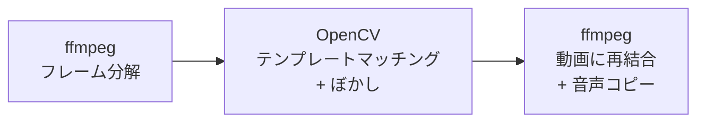
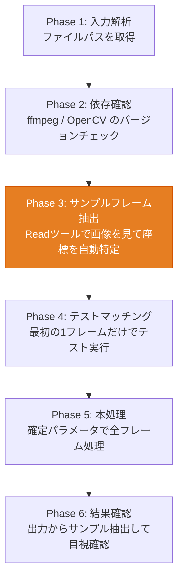

## ターミナル録画、共有する前に見直してる？

Claude Codeの操作画面を録画してXに投稿しようとした。再生して確認したら、ターミナルにこんな行が映ってた。

```
pencil – Batch Design (MCP)(filePath: "c:\\Users\\自分の名前\\Documents\\Projects\\app...
```

ユーザー名が丸見え。しかもこの `filePath:` の行、MCP呼び出しのたびに出る。46秒の動画で10回以上。手作業でモザイクかけるのは現実的じゃない。1箇所見落としたらアウト。

動画編集ソフトで対応する手もあるけど、フレーム単位で追いかけてモザイクの位置を毎回調整する作業を想像して萎えた。

だから自動で全フレームをスキャンしてパスだけをぼかすツールを作った。

https://github.com/Sora-bluesky/video-path-mask

## 3ステップのパイプライン

仕組みはシンプルで、やってることは3つだけ。



ffmpegで動画を全フレームのJPEGに分解する。30fpsの46秒動画なら1385枚。次にOpenCVのテンプレートマッチングで、マスクしたい文字列のピクセルパターンを全フレームから探す。見つかったらガウスぼかしをかけて、またffmpegで動画に戻す。音声は元動画からそのままコピー。

テンプレートマッチングが肝で、OCRのような重い処理は使わない。「この見た目のピクセル配列はどこにあるか」を画像の相関で探すだけだから速い。1385フレームの処理が2分で終わる。

## セットアップ

ffmpegとPythonが動く環境なら、依存パッケージは `opencv-python-headless` だけ。

```bash
git clone https://github.com/Sora-bluesky/video-path-mask.git
cd video-path-mask
pip install -r requirements.txt
```

ffmpegは別途インストールが必要。Windowsなら [公式サイト](https://ffmpeg.org/download.html) からダウンロードしてPATHを通す。macOSなら `brew install ffmpeg`。

:::message
ffmpegにPATHが通っているか確認するには、ターミナルで `ffmpeg -version` を実行する。バージョンが表示されればOK。
:::

## テンプレートの作り方

最初のフレームを抽出して、マスクしたい文字列の座標を調べる。

```bash
ffmpeg -i input.mp4 -vframes 1 -q:v 2 first_frame.jpg
```

`first_frame.jpg` を画像ビューアで開いて、パスが映ってる行の座標を調べる。Windowsのペイントならマウスカーソルを合わせるとステータスバーにピクセル座標が表示される。

切り出すのはパス全体じゃなくて、**特徴的な一部分**でいい。`Users\\yourname\\Documents` のような、動画内で他の文字列と被らない固有の部分を選ぶ。テンプレートが汎用的すぎると誤検出する。固有すぎるとフォントレンダリングの微差で取りこぼす。

```python
import cv2
img = cv2.imread('first_frame.jpg', cv2.IMREAD_GRAYSCALE)
template = img[150:168, 870:990]  # y, x の範囲
cv2.imwrite('template.png', template)
```

この18x120ピクセルのテンプレートが全フレームの検索キーになる。

## 実行

テンプレート画像を渡すのがおすすめ。座標を覚えなくていい。座標を直接指定するモードもある。

```bash
# 座標指定（x, y, 幅, 高さ）
python mask_path.py input.mp4 output.mp4 --region 870,150,120,18

# テンプレート画像指定
python mask_path.py input.mp4 output.mp4 --template template.png
```

46秒の動画（1385フレーム）で1505箇所をマスクして、処理時間は約2分。一部のフレームではMCP呼び出しが2回映っていたから、フレーム数より多くなってる。

Before: `filePath: "c:\\Users\\yourname\\Documents\\Projects\\app...` が丸見え
After: `filePath:` の後ろがガウスぼかしで読めなくなる。コードの他の部分やUI画面は一切触ってない。

実際にマスクした動画がこれ。パス部分だけがぼかされて、他は一切変わっていないのがわかると思う。

https://x.com/sora_biz/status/2036780221765226724

## チューニング

### マッチング閾値

`cv2.matchTemplate` の結果に閾値をかけて、一致度が高い箇所だけを拾う。

```bash
python mask_path.py input.mp4 output.mp4 --template template.png --threshold 0.65
```

0.65がデフォルト。ターミナルのフォントはフレームごとにレンダリングが微妙に揺れるから、厳密に1.0を要求すると取りこぼす。逆に0.5まで下げると関係ない場所がヒットし始める。

僕の動画で試した限り、0.65で全フレームのパスを検出できて誤検出はゼロだった。ただ動画によって事情は違うから、一度テスト実行してから本処理に進めたほうがいい。

### ぼかし領域のパディング

テンプレートにヒットした座標の周囲にパディングを足して、パス文字列全体をカバーする。テンプレートは `Users\\yourname\\Documents` の部分だけだから、その前後の `c:\\` や `\\Projects\\app...` もぼかす必要がある。

```bash
python mask_path.py input.mp4 output.mp4 --template template.png \
  --pad-left 30 --pad-right 150 --pad-top 2 --pad-bottom 2
```

パディングが足りないとパスの端っこが見える。多すぎるとコードの他の部分まで消える。迷ったら広めに取って、結果を見ながら絞っていく。

### 複数箇所のマスク

ユーザー名がパス以外の場所にも映ってるとか、APIキーも一緒にマスクしたいとか、そういう場合は連続実行する。

```bash
# 1箇所目: ファイルパスのマスク
python mask_path.py input.mp4 temp.mp4 --region 870,150,120,18

# 2箇所目: APIキーのマスク（1箇所目の出力を入力にする）
python mask_path.py temp.mp4 output.mp4 --region 400,300,200,18
```

中間ファイル `temp.mp4` を経由して、最終出力を `output.mp4` にする。3箇所以上なら `temp1.mp4`, `temp2.mp4` と増やせばいい。

### 近接マッチの重複除去

テンプレートマッチングは1ピクセルずれた位置でも高スコアを返すことがある。同じパス行に対して3箇所ヒットしたら、3回ぼかしをかけることになる（実害はないけど無駄）。

この重複は自動で除去される。x方向20px以内、y方向10px以内のマッチは同一箇所として扱う。特に設定は不要。

## Claude Codeスキルとして使う

ここからが本題かもしれない。テンプレートの座標を調べて、コマンドを組み立てて、パディングを調整して...という手順を毎回やるのは面倒。Claude Codeのスキルにすれば「動画のパスをマスクして」で全部やってくれる。

### スキルのインストール

```bash
cp -r video-path-mask/.claude/skills/mask-video ~/.claude/skills/
```

これでClaude Codeのスキルディレクトリにワークフローが登録される。

:::message
スキルの中身（SKILL.md）はプロンプトで書かれたワークフロー定義なので、自分の環境や用途に合わせて自由に書き換えて使える。たとえばデフォルトの閾値を変えたい、特定のディレクトリを常にマスク対象にしたい、といった調整はSKILL.mdを編集するだけでいい。

実際に何本か動画をマスクしてみると「この閾値だと取りこぼす」「このパディングだと足りない」といった知見が溜まる。それをClaude Codeに「さっきの結果を踏まえてSKILL.mdを改善して」と伝えれば、スキル自体が自分の環境に最適化されていく。使うほど育つスキルになる。
:::

### 何が起きるか

スキルは6つのフェーズで動く。



Phase 3が一番おもしろい。Claude Codeはマルチモーダル対応だから、フレーム画像をReadツールで読み込むだけで「ここにパスが映ってますね、座標は (870, 150) あたりです」と返してくる。人間が画像ビューアで座標を調べる作業を、Claude Codeの画像認識が肩代わりする。

Phase 4ではテストマッチングの結果画像をまたReadツールで読み込んで、「ぼかしが正しくかかってます。ただ右端が少しはみ出してるのでパディングを調整します」と自分で判断してパラメータを修正する。人間はプロンプトを投げるだけ。

### 使い方

```
動画 input.mp4 のファイルパスをマスクして
```

これだけ。Claude Codeがフレーム抽出して、画像を見て、座標を特定して、テスト実行して、パラメータを調整して、本処理を回して、結果を確認して、一時ファイルを片付ける。

複数箇所マスクしたい場合も「パスとAPIキーの両方をマスクして」と言えば、連続実行を勝手に組み立ててくれる。

## パス以外にも使える

テンプレートマッチングだからパスに限らない。

- APIキー（`sk-ant-` のプレフィックス部分をテンプレートにする）
- メールアドレス（`@gmail.com` 周辺をテンプレートにする）
- IPアドレス
- 任意のターミナル出力

「特定の文字列パターンが動画内に繰り返し映る」ケースなら何でもいける。

## 限界

テキストの位置が固定じゃなくてスクロールで動く場合でも追従する。テンプレートマッチングはピクセルパターンの一致で探すから、座標が変わっても問題ない。

ただし対応できないケースもある。

- フォントサイズや色が途中で変わる（テンプレートが一致しなくなる）
- 動画の解像度が極端に低い（テンプレートのピクセルが潰れる）
- マスク対象が1回しか映らない（手作業のほうが速い）

繰り返し出現するパターンを自動で潰すのが得意なツールで、1箇所だけのマスクなら動画編集ソフトのほうが早い。割り切って使い分けるのがいい。

## リポジトリ

https://github.com/Sora-bluesky/video-path-mask

MIT ライセンス。Python + ffmpeg + OpenCV が動く環境なら追加の依存はない。

:::message
**公式ドキュメント**
- [OpenCV Template Matching](https://docs.opencv.org/4.x/d4/dc6/tutorial_py_template_matching.html)（ブラウザの翻訳機能で日本語に変換して読める）
- [ffmpeg Documentation](https://ffmpeg.org/ffmpeg.html)（ブラウザの翻訳機能で日本語に変換して読める）
- [Claude Code Skills](https://code.claude.com/docs/en/skills)
- [Claude Code Skills（日本語）](https://code.claude.com/docs/ja/skills)
:::

## 参考リンク

- [video-path-mask リポジトリ](https://github.com/Sora-bluesky/video-path-mask) -- 本記事で紹介したツール
- [OpenCV Template Matching Tutorial](https://docs.opencv.org/4.x/d4/dc6/tutorial_py_template_matching.html) -- テンプレートマッチングの公式チュートリアル
- [ffmpeg Documentation](https://ffmpeg.org/ffmpeg.html) -- ffmpegの公式ドキュメント
- [Claude Code Skills](https://code.claude.com/docs/en/skills) / [日本語版](https://code.claude.com/docs/ja/skills) -- Claude Codeのスキル機能
