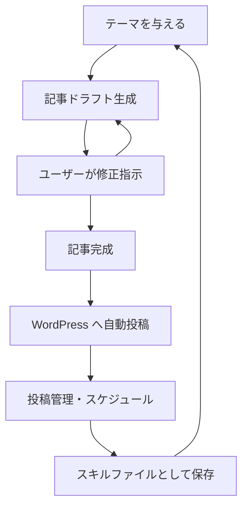

:::message
**シリーズ構成：AIでWordPressテーマを自作する**
1. [有料テーマを買わない選択肢：Google Stitch × Google AntigravityでWordPressテーマを自作する](https://zenn.dev/komei/articles/wordpress-ai-theme-overview)
2. [デザインできなくてもOK：Google StitchでUIを生成](https://zenn.dev/komei/articles/wordpress-ai-theme-stitch)
3. [コードを書かずにPHPテンプレートを作る：Google Antigravity活用ガイド](https://zenn.dev/komei/articles/wordpress-ai-theme-antigravity)
4. [プロ品質に仕上げる：Google Antigravityでセキュリティと品質管理を自動化](https://zenn.dev/komei/articles/wordpress-ai-theme-quality)
5. **AIで記事を量産する**（この記事）
:::

## はじめに

前回までの記事で、AIを使ったWordPressテーマの自作が完了しました。

この記事では、テーマ制作の先にある**サイト運用の自動化**を解説します。Google Antigravityのチャット・ブラウザエージェント・ターミナル機能を組み合わせて、**記事の執筆から入稿までを一気通貫で自動化**するワークフローを構築します。

## 有料テーマでは不可能な「運用の自動化」

有料テーマはあくまで「器」です。どんなに高機能なテーマを買っても、記事を書き、画像を用意し、WordPressに投稿する作業は毎回手動です。

しかしGoogle Antigravityでテーマを自作した場合、**テーマのコード全体がAntigravityのコンテキストに入っている**ため、そのままコンテンツ制作に移行できます。

## ワークフロー構想：記事の量産パイプライン

Google Antigravityには、コンテンツ制作の自動化に必要な技術基盤がすべて揃っています。

| 技術基盤 | Antigravityの機能 | ワークフローでの役割 |
|---|---|---|
| チャットによるコンテンツ生成 | Gemini 3 Proとの対話 | 記事ドラフト・構成案の生成 |
| ブラウザ操作の自動化 | ブラウザエージェント | WordPress管理画面での投稿操作 |
| ターミナルからのコマンド実行 | シェルアクセス | WP-CLI・REST API呼び出し |
| 画像生成 | Gemini経由の画像生成 | アイキャッチ画像の自動生成 |
| ワークフローの保存・再利用 | スキルファイル（`.skillmd`） | パイプラインのコマンド化 |

### 自動化パイプラインの流れ



## Step 1：チャットで記事ドラフトを生成

テーマを作ったあと、同じGoogle Antigravityのチャットでこう続けるだけです。

```
このWordPressテーマは不動産会社向けです。
ターゲット読者は「初めてマンションを購入する30代夫婦」。
以下の条件でブログ記事の下書きを5本作ってください。

- 各記事1,500〜2,000文字
- SEOを意識したH2/H3見出し構成
- 記事末尾にCTAとして「無料相談はこちら」を配置
- WordPress投稿用のHTMLブロックとして出力
```

### ポイント：テーマとの整合性

Google Antigravityはテーマのコード全体をコンテキストとして保持しているため、テーマのデザイントーンやCSS命名規則と**整合性のある記事装飾**を自動で適用できます。

テーマとコンテンツを別々のツールで作る場合には得られない一貫性です。

## Step 2：アイキャッチ画像の生成

Google Antigravity APIを経由したGemini 3 Proの画像生成機能で、記事のアイキャッチ画像も生成できます。

```
上記5本の記事それぞれに合うアイキャッチ画像を生成してください。
- テーマのメインカラー（#1B2A4A）を基調
- 16:9比率、1200×675px
- テキストオーバーレイなし（記事タイトルはWordPress側で表示する）
```

生成された画像は、後のステップでWordPressのメディアライブラリにアップロードします。

## Step 3：WordPressへの投稿

生成した記事と画像をWordPressに投稿する方法は3つあります。

### 方法A：WordPress REST API（推奨）

最も安定した方法です。[WordPress REST API](https://developer.wordpress.org/rest-api/)を使ってプログラム的に投稿を作成できます。

**アプリケーションパスワードの取得**

1. WordPress管理画面 → ユーザー → プロフィール
2. 「アプリケーションパスワード」セクションで新規パスワードを生成
3. ユーザー名とパスワードをBase64エンコード

**投稿作成のリクエスト**

```bash
curl -X POST "https://example.com/wp-json/wp/v2/posts" \
  -H "Authorization: Basic $(echo -n 'username:app_password' | base64)" \
  -H "Content-Type: application/json" \
  -d '{
    "title": "マンション購入の基礎知識",
    "content": "<!-- wp:paragraph --><p>記事本文...</p><!-- /wp:paragraph -->",
    "status": "draft",
    "categories": [3],
    "tags": [5, 8]
  }'
```

**Google Antigravityへの指示例**

```
WordPress REST APIを使って、以下の記事を投稿してください。

サイトURL: https://example.com
認証: アプリケーションパスワードを使用
ステータス: 下書き（draft）

記事データ:
- タイトル: マンション購入の基礎知識
- カテゴリ: 不動産コラム
- 本文: [生成した記事本文]
```

### 方法B：WP-CLI（ローカル環境向け）

[WP-CLI](https://developer.wordpress.org/cli/commands/)を使って、wp-nowで起動したローカル環境やSSH接続可能なサーバーで操作できます。

```bash
# 投稿を作成
wp post create --post_title="マンション購入の基礎知識" \
  --post_content="記事本文..." \
  --post_status=draft

# 画像をアップロードしてアイキャッチに設定
wp media import ./featured-image.jpg --post_id=123 --featured_image
```

**Google Antigravityへの指示例**

```
WP-CLIを使って、以下の記事をWordPressに投稿してください。

- wp post create でドラフト記事を作成
- wp media import で画像をアップロード
- --featured_image オプションでアイキャッチに設定
```

### 方法C：ブラウザエージェント（GUI操作）

Google AntigravityのブラウザエージェントでWordPress管理画面を直接操作する方法です。

```
ブラウザで https://example.com/wp-admin を開いてログインし、
新規投稿画面から以下の記事を作成してください。

- タイトル: マンション購入の基礎知識
- 本文: [記事本文]
- カテゴリ: 不動産コラム
- アイキャッチ画像: references/featured-image.jpg をアップロード
- ステータス: 下書きとして保存
```

:::message alert
**ブラウザエージェントの注意点**
- WordPressのUIバージョンによって挙動が変わる可能性がある
- 大量の投稿には向かない（REST APIの方が効率的）
- ログイン情報の取り扱いに注意
:::

### 方法の比較

| 方法 | 安定性 | 大量投稿 | セットアップ | 推奨ケース |
|---|---|---|---|---|
| REST API | 高 | 向いている | 中 | 本番運用 |
| WP-CLI | 高 | 向いている | 低（ローカル） | ローカル開発 |
| ブラウザエージェント | 中 | 向かない | 低 | 少数の投稿、検証 |

## Step 4：投稿管理とスケジュール

### 公開スケジュールの設定

REST APIで投稿日時を指定できます。

```bash
curl -X POST "https://example.com/wp-json/wp/v2/posts" \
  -H "Authorization: Basic ..." \
  -H "Content-Type: application/json" \
  -d '{
    "title": "マンション購入の基礎知識",
    "content": "...",
    "status": "future",
    "date": "2026-02-15T09:00:00"
  }'
```

**Google Antigravityへの指示例**

```
以下の5記事を、毎週月曜日9:00に公開されるようスケジュール投稿してください。

1. マンション購入の基礎知識 → 2026-02-10 09:00
2. 住宅ローンの選び方 → 2026-02-17 09:00
3. 内覧のチェックポイント → 2026-02-24 09:00
4. 諸費用の内訳を解説 → 2026-03-03 09:00
5. 契約から引き渡しまでの流れ → 2026-03-10 09:00
```

### カテゴリ・タグの自動付与

記事内容に基づいてカテゴリやタグを自動提案させることもできます。

```
以下の記事本文を読んで、適切なカテゴリとタグを提案してください。

カテゴリ候補: 購入ガイド, 資金計画, 物件探し, 契約・手続き
タグ候補: 初心者向け, 住宅ローン, マンション, 一戸建て, 中古物件

提案後、REST APIで投稿を更新してください。
```

## Step 5：ワークフローのスキル化

ここまでの一連の流れをGoogle Antigravityのスキルファイルとして保存すれば、以降はコマンド一発で実行できます。

### スキルファイルの例

```markdown
---
name: wordpress-content-pipeline
description: キーワードからWordPress記事を生成・投稿するパイプライン
---

## パラメータ
- keywords: 記事のテーマとなるキーワード（カンマ区切り）
- count: 生成する記事数（デフォルト: 5）
- schedule: 公開スケジュール（weekly/daily/none）

## ワークフロー
1. キーワードから記事構成を生成
2. 各記事の本文をSEO意識で生成
3. アイキャッチ画像を生成
4. WordPress REST APIで投稿
5. スケジュールに従って公開日時を設定
```

### スキルの実行

```
/run wordpress-content-pipeline --keywords "住宅ローン,頭金,内覧" --count 5 --schedule weekly
```

## 実践例：不動産会社のコンテンツマーケティング

### 月間コンテンツカレンダーの自動生成

```
不動産会社のコンテンツマーケティング計画を立ててください。

ターゲット: 初めてマンションを購入する30代夫婦
期間: 2026年3月
目標: 月間12記事（週3記事ペース）

以下の構成で提案してください:
1. 各週のテーマ
2. 記事タイトル案
3. 想定キーワード
4. 公開日

提案後、承認したら全記事を自動生成・スケジュール投稿してください。
```

### 季節イベントに合わせた記事生成

```
以下の季節イベントに合わせた記事を生成してください。

- 3月: 引越しシーズン → 「新生活に向けた物件探しのコツ」
- 4月: 新年度 → 「住宅ローン減税の最新情報」
- 9月: 台風シーズン → 「マンションの防災対策」

各記事2,000文字、SEO最適化済み、アイキャッチ画像付きで生成し、
適切な日付でスケジュール投稿してください。
```

## 注意事項

### AIが生成したコンテンツの品質管理

AI生成コンテンツは必ず人間がレビューしてください。

| チェック項目 | 内容 |
|---|---|
| 事実確認 | 数値、法律、制度の情報が正確か |
| オリジナリティ | 他サイトのコピーになっていないか |
| ブランドトーン | 会社のブランドイメージに合っているか |
| SEO品質 | キーワードが自然に含まれているか |

### 大量投稿の注意

- 短期間での大量投稿はGoogleにスパム判定されるリスクがある
- 適切な間隔（週2〜3記事程度）でのスケジュール投稿を推奨
- 既存コンテンツとの重複に注意

### セキュリティ

- アプリケーションパスワードは安全に管理
- 本番サイトへの投稿前にステージング環境でテスト
- ログイン情報をスキルファイルにハードコードしない

## まとめ

- Google Antigravityでは、テーマ制作からコンテンツ制作まで同じ環境で継続できる
- チャット → 画像生成 → REST API/WP-CLI → スケジュール投稿の一気通貫ワークフロー
- スキルファイルに保存すれば、コマンド一発で量産可能
- AI生成コンテンツは必ず人間がレビューすること

## シリーズまとめ

本シリーズ「AIでWordPressテーマを自作する」では、以下の内容を解説しました。

| 記事 | 内容 |
|---|---|
| [概要編：有料テーマを買わない選択肢](https://zenn.dev/komei/articles/wordpress-ai-theme-overview) | なぜAIでテーマを作るのか、コスト比較、全体像 |
| [Stitch編：デザインできなくてもOK](https://zenn.dev/komei/articles/wordpress-ai-theme-stitch) | Google StitchでUIデザインを生成 |
| [Antigravity編：コードを書かずにPHPテンプレートを作る](https://zenn.dev/komei/articles/wordpress-ai-theme-antigravity) | デザインからPHPテンプレートを自動生成 |
| [品質編：プロ品質に仕上げる](https://zenn.dev/komei/articles/wordpress-ai-theme-quality) | セキュリティ、Coding Standards、ブロックテーマ |
| [自動化編：AIで記事を量産する](https://zenn.dev/komei/articles/wordpress-ai-theme-automation) | 記事の量産パイプライン構築 |

有料テーマを「選ぶ」のではなく「作る」時代。そしてテーマを作った先には**サイト運用そのものを自動化する**という、有料テーマでは到達できなかった地平が広がっています。

ぜひ本シリーズを参考に、AIを活用したWordPress開発に挑戦してみてください。

## 参考リンク

**WordPress公式ドキュメント**

- [REST API Handbook](https://developer.wordpress.org/rest-api/)
- [REST API Posts Endpoint](https://developer.wordpress.org/rest-api/reference/posts/)
- [WP-CLI Commands](https://developer.wordpress.org/cli/commands/)
- [WP-CLI `wp post create`](https://developer.wordpress.org/cli/commands/post/create/)
- [WP-CLI `wp media import`](https://developer.wordpress.org/cli/commands/media/import/)

**ツール**

- [Google Antigravity IDE](https://antigravity.google/)
- [Google AI Pro](https://one.google.com/intl/ja_jp/about/google-ai-plans/)
- [WordPress.com MCP Server](https://developer.wordpress.com/docs/mcp/)
