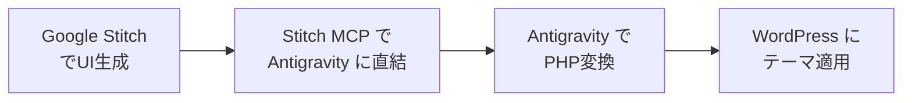
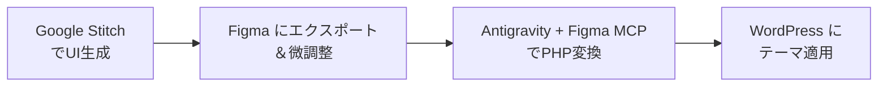

:::message
**シリーズ構成：AIでWordPressテーマを自作する**
1. **有料テーマを買わない選択肢**（この記事）
2. [StitchでテーマのUIを作った](wordpress-ai-theme-stitch)
3. [デザインからPHPテンプレートを自動生成した](wordpress-ai-theme-antigravity)
4. [AI生成コードのセキュリティを固めた](wordpress-ai-theme-quality)
5. [記事の執筆から投稿までを自動化した](wordpress-ai-theme-automation)
:::

## はじめに：1万5千円の有料テーマを買う前に読んでほしい

この記事を読むと、有料テーマを買わずにGoogle StitchとGoogle AntigravityでWordPressテーマを自作するワークフローの全体像と、無料枠の範囲・限界が分かります。実際の操作手順は扱わず、次の記事以降で進めます。

WordPressで本格的なサイトを作ろうとすると、多くの人が最初にぶつかるのが**テーマ選びの壁**です。

国内で人気の有料テーマは、買い切りで1万円〜2万円台が相場。SEO対策やデザインテンプレートが充実していて、初心者にとっての「安心料」として定番の選択肢になっています。

（執筆時点（2026年2月）の価格です。最新の価格は各テーマの公式サイトで確認してください。）

| 価格帯 | 特徴 | 代表的な用途 |
|---|---|---|
| ¥11,000〜¥14,800 | ブログ特化、SEO標準装備 | 個人ブログ、アフィリエイト |
| ¥16,280〜¥19,800 | 高デザイン性、ブロックエディタ完全対応 | コーポレートサイト、メディア |
| ¥27,280〜¥39,800 | SEO機能が充実、上位版プラグイン込 | プロフェッショナルサイト |

しかし、有料テーマには**お金を払っても解決しない構造的な問題**が存在します。

本シリーズでは、Google StitchとGoogle Antigravityを組み合わせて、**有料テーマを買わずにオリジナルテーマを自作するワークフロー**を解説します。

## 有料テーマでも解決しない「3つの壁」

有料テーマには確かな価値がありますが、購入しても解消されない**テーマ固有の構造的問題**が3つあります。

### 壁1：設定地獄

有料テーマはインストールしただけではデモサイトのようにはなりません。カラー設定、レイアウト設定、ウィジェット配置、メニュー構成など、多数の設定を正しく埋めて、ようやくデモと同じ見た目になります。

### 壁2：カスタマイズの天井とロックイン

テーマが想定していない改修をしようとすると、内部の複雑なコードを読み解く必要があり、ゼロから作るより時間がかかることすらあります。

しかも一度テーマに依存すると、テーマ変更時にウィジェットやメニュー、独自装飾がすべてリセットされるリスクも抱えます。

### 壁3：デザインの画一性

人気テーマは利用者が多いぶん、他サイトと見た目が似てしまいがちです。管理画面で変えられるのは配色やフォント程度で、レイアウトの骨格はテンプレートの制約から逃れられません。

:::message
**補足：WordPress.com の AI Website Builder について**
2025年4月にWordPress.comがAIサイトビルダーを発表しましたが、これはWordPress.com（ホスティング型）の機能であり、自分でサーバーにインストールするセルフホスト版WordPressとは別物です。本シリーズが対象とするのはセルフホスト版のテーマ開発です。
:::

## この3つの壁を、StitchとAntigravityはどう壊すのか

2025年5月にGoogle I/Oで発表された**Google Stitch**（テキストプロンプトからUIデザインとHTML/CSSを自動生成）と、Googleが開発した**Google Antigravity**（AIファーストIDE）。この2つを組み合わせると、3つの壁はすべて崩れます。

| 壁 | StitchとAntigravityによる解決策 |
|---|---|
| 設定地獄 | Stitchが生成したデザインがそのままコードになるので、「デモに合わせる設定作業」が存在しない |
| カスタマイズの天井 | コード全量が自分のパソコンにあり、修正したい箇所をAntigravityに自然言語で依頼できる。テーマベンダーへの依存もない |
| デザインの画一性 | テンプレートの流用ではなく、Stitchがゼロから生成するので、他のサイトと同じデザインになりにくい |

しかも、いずれのAIツールにも無料枠が用意されており、計画的に使えばコストゼロでテーマ制作を完結できます。

## コスト比較：従来 vs AIワークフロー

### 従来の方法（有料テーマ購入）

| 項目 | 費用 | 備考 |
|---|---|---|
| 有料テーマ | ¥11,000〜¥39,800 | 買い切り。上位版やプラグイン追加でさらに増加 |
| レンタルサーバー | 月額 ¥500〜¥1,500 | 必須 |
| ドメイン | 年額 ¥1,000〜¥3,000 | 必須 |
| **初期費用合計** | **¥12,500〜¥44,300** | テーマ＋サーバー半年＋ドメイン |

制作会社に依頼すれば**数十万円**〜が相場です。

### 本シリーズのワークフロー

| ツール | 料金 | 備考 |
|---|---|---|
| [Google Stitch](https://stitch.withgoogle.com/) | **無料（月間制限あり）** | Stitch 2.0：標準モード無制限／Experimentalモード月400回 |
| [Google Antigravity](https://antigravity.google/) | **無料（週間制限あり）** | パブリックプレビュー期間中。週単位のクォータ制限（[詳細](https://skywork.ai/blog/antigravity-pricing/)） |
| [Stitch MCP](https://www.npmjs.com/package/@_davideast/stitch-mcp) | **無料** | npm パッケージ（制限なし） |
| [wp-now](https://www.npmjs.com/package/@wp-now/wp-now) | **無料** | ローカルWordPress環境 |
| レンタルサーバー | 月額 ¥500〜¥1,500 | 必須（従来と同じ） |
| ドメイン | 年額 ¥1,000〜¥3,000 | 必須（従来と同じ） |
| **テーマ制作コスト** | **¥0〜** | 無料枠内で完結可能 |

無料枠内で収まれば**テーマにかかるコストはゼロ**になり、テンプレートの制約に縛られない**完全オリジナルデザイン**が手に入ります。

:::message alert
**無料枠の制限について（2026年2月時点）**
- **Stitch**：[Stitch 2.0](https://www.aifire.co/p/google-stitch-2-0-a-guide-to-the-free-ai-coding-design-agent)では標準モード（Gemini 2.5 Flash）が無制限、Experimentalモード（Gemini 2.5 Pro）が月400回に拡充。以前の制限（標準350回/試験運用200回）から改善
- **Antigravity**：週単位のクォータ制限があり、集中的に利用すると途中で制限がかかるケースが報告されている。クォータは「作業量」ベースで計算され、複雑なタスクほど消費が大きい

制限を超えて使いたい場合は、[Google AI Pro](https://one.google.com/intl/ja_jp/about/google-ai-plans/)（月額¥2,900・初月無料トライアルあり）へのアップグレードで対応できます。
:::

:::message
**料金・制限は変動の可能性あり**
Google StitchとAntigravityはプレビュー段階のため、料金体系や制限が予告なく変更される場合があります。最新情報は各公式サイトで確認してください。
:::

## 全体像：2つのワークフロー

本シリーズでは2つのルートを紹介します。状況に応じて使い分けてください。

### ルートA：Stitch MCP直結ルート（最短・推奨）

```mermaid
graph LR
    A[Google Stitch<br/>でUI生成] --> B[Stitch MCP で<br/>Antigravity に直結]
    B --> C[Antigravity で<br/>PHP変換]
    C --> D[WordPress に<br/>テーマ適用]
```

Figmaを経由しない最短ルートです。Stitch MCPがGoogle Stitchのデザインデータを直接Google Antigravityに渡します。

### ルートB：Figma経由ルート（デザイン微調整が必要な場合）

```mermaid
graph LR
    A[Google Stitch<br/>でUI生成] --> B[Figma にエクスポート<br/>＆微調整]
    B --> C[Antigravity + Figma MCP<br/>でPHP変換]
    C --> D[WordPress に<br/>テーマ適用]
```

デザインを手動で細かく調整したい場合はFigma経由が便利です。

| ルート | メリット | デメリット | 推奨ケース |
|---|---|---|---|
| **A：Stitch MCP直結** | 最速。設定が最小限 | デザインの微調整が難しい | まずは動くテーマを素早く作りたい |
| **B：Figma経由** | デザインを細かく調整可能 | 工程が1つ増える | レイヤー構造やカラーの精緻な調整が必要 |

## なぜGoogle Antigravityなのか

本シリーズではGoogleのAIファーストIDE **Google Antigravity** をメインツールとして採用しています。

### Googleエコシステムの相乗効果

Google Stitchと同じGoogleエコシステムに属するGoogle Antigravityを選ぶ理由は5つあります。

1. **Stitch MCPで直結できる**：Stitchの出力をFigmaを経由せず直接Antigravityに渡せる最短ルートです
2. **Google認証の共有**：Stitch、Stitch MCP、AntigravityはすべてGoogle Cloud認証を共有します。アカウント設定が一度で済みます
3. **Gemini 3.1 Proの設計理解力**：高い画像理解能力で、大規模なデザイン構造もそのまま把握できます
4. **ブラウザエージェント**：生成したWordPressテーマをブラウザ上で自動検証できる機能は、Antigravity独自の強みです
5. **無料枠が実用的**：パブリックプレビュー期間中は無料で利用できます。1テーマの制作には十分な枠が提供されています

:::message
Google Antigravityの詳細なインストール方法は以下の記事を参照してください。
→ [Google Antigravity 非エンジニア向け導入ガイド](antigravity-windows-install-guide)
:::

## 代替ツール：Claude Codeが適するケース

Google Antigravityがベストフィットしないケースもあるため、Claude Code（Anthropic社のCLIベースAIコーディングエージェント）も紹介します。

### Claude Codeを検討すべきケース

- **業務でFigmaの非公開ファイルを扱うWeb制作者**：AntigravityはFigmaの非公開ファイルにアクセスできません。Claude CodeはFigma APIトークンで認証するため、クライアントの非公開デザインファイルを直接参照できます
- **すでにClaude Proに課金しているユーザー**：月額$20のサブスクリプションを活用したい場合、追加コストなしでテーマ開発に使えます
- **日本語のチュートリアルだけで完結させたい人**：Claude Code × WordPress の日本語記事は豊富です。Antigravityの日本語情報はまだ発展途上です
- **ターミナル操作に慣れた開発者**：CLI上で直接ファイルを作成・編集するワークフローを好む場合に向きます

### 比較表

| 比較項目 | Google Antigravity（推奨） | Claude Code（代替） |
|---|---|---|
| Stitch MCP直結 | デフォルト第一選択肢 | 対応 |
| Figma MCP設定 | MCP Storeからワンクリック | mcp_config.json手動編集 |
| 非公開Figmaファイル | 非対応 | APIトークン認証で対応 |
| ブラウザ自動検証 | ブラウザエージェント（IDE統合） | Claude in Chrome拡張（β） |
| 並列タスク実行 | Agent Manager（GUI管理） | サブエージェント（CLI、最大10並列） |
| デザイン理解力 | Gemini 3.1 Pro | Claude Sonnet 5.5 |
| WordPress日本語情報 | 少ない（英語中心） | 豊富 |
| 料金 | **無料（週間クォータ制限あり）** | **$20/月** |
| 安定性 | パブリックプレビュー | プロダクション利用可 |

:::message
Claude Codeの詳細なインストール方法は以下の記事を参照してください。
→ [Claude Code 非エンジニア向け完全ガイド（Windows）](claude-code-windows-install-guide)
:::

## このワークフローの限界と注意点

実際に試して感じた限界を共有します。

### Google Stitchの限界

- **生成できるのは2〜3画面が限度**：大規模テーマには向きません
- **デザインの一貫性が崩れやすい**：画面ごとに微妙にトーンが変わることがあります
- **日本語フォントの取り扱いが弱い**：生成後にフォント指定の修正が必要です
- **出力はHTML + TailwindCSS固定**：WordPress PHPは直接出力できません

### Google Antigravityの限界

- **パブリックプレビュー段階**：予告なく仕様が変更される可能性があります
- **日本語情報が少ない**：トラブル時に英語ドキュメントを読む必要があります
- **非公開Figmaファイルにアクセスできない**：業務利用で制約になる場合があります

### 生成されたテーマ全般の限界

- **レスポンシブ対応は手動が必要**：ブレイクポイントの設定は生成コードで崩れやすい部分です
- **WordPress特有のテンプレートタグ**：細かく指示しないと正しく出力されません

### 手動作業が必要になりやすい部分

| 項目 | 手動作業が必要な部分 |
|---|---|
| HTML構造 | セマンティックタグの調整 |
| CSSスタイリング | レスポンシブ・フォント調整 |
| PHPテンプレートタグ | WordPress固有関数の正確な配置 |
| functions.php | 生成は可能だが要検証 |

それでも、ゼロからデザインしてコーディングするより時間を短縮しやすいのは事実です。特に「デザインができない」という最初のボトルネックを解消できる点に、このワークフローの最大の価値があります。

## シリーズの対象読者

本シリーズは以下の方を対象としています。

### 対象

- WordPressの基本操作（投稿、プラグイン導入）ができる人
- 有料テーマの購入を検討しているが、コストや制約に不満を感じている人
- プログラミング経験はないが、AIを活用して自分だけのサイトを作りたい人

### 非対象

- WordPress自体が初めての人（先にWordPress入門が必要）
- すでにテーマ開発経験があり、自力でPHPを書ける人

## 前提条件

各記事を読み進める前に、以下の準備が必要です。

| 項目 | 詳細 |
|---|---|
| Googleアカウント | Google Stitch、Antigravityの利用に必要 |
| Google Antigravity | インストール済み（[導入ガイド](antigravity-windows-install-guide)） |
| WordPressの基本知識 | 管理画面の操作、投稿作成ができるレベル |

## 次の記事へ

シリーズの全体像を把握したら、次は実際にGoogle Stitchでデザインを生成するステップに進みましょう。

**次の記事**: [デザインできなくてもOK：Google StitchでWordPressのUIを生成する](wordpress-ai-theme-stitch)

## まとめ：有料テーマを「選ぶ」時代から「作る」時代へ

この記事で、有料テーマの3つの壁、StitchとAntigravityで自作する2つのルート、無料枠の範囲と限界が分かりました。次の記事から、実際にStitchでデザインを生成します。

- 有料テーマは設定地獄・カスタマイズの天井・デザインの画一性が残る
- Stitch MCP直結ルートとFigma経由ルートの2つがある
- 無料枠には月間・週間の制限があり、生成物には手動調整が必要になる

有料テーマには長年の実績と安定性があり、今後もWordPress開発の選択肢であり続けるでしょう。一方で、かつては1〜2万円の投資が必要だった「美しいWordPressテーマ」を、StitchとAntigravityの無料枠の範囲で自作する選択肢も出てきました。

## 参考リンク

**本シリーズで使うツール**

- [Google Stitch 公式](https://stitch.withgoogle.com/)
- [Google Antigravity IDE](https://antigravity.google/)
- [Stitch MCP（npm）](https://www.npmjs.com/package/@_davideast/stitch-mcp)
- [Stitch Skills（GitHub）](https://github.com/google-labs-code/stitch-skills)
- [wp-now（npm）](https://www.npmjs.com/package/@wp-now/wp-now)

**Google AI有料プラン**

- [Google AIプランの詳細](https://one.google.com/intl/ja_jp/about/google-ai-plans/)

**WordPress公式ドキュメント**

- [WordPress Theme Handbook](https://developer.wordpress.org/themes/)
- [WordPress REST API Handbook](https://developer.wordpress.org/rest-api/)

**関連記事**

- [Google Antigravity 非エンジニア向け導入ガイド](antigravity-windows-install-guide)
- [Claude Code 非エンジニア向け完全ガイド（Windows）](claude-code-windows-install-guide)
